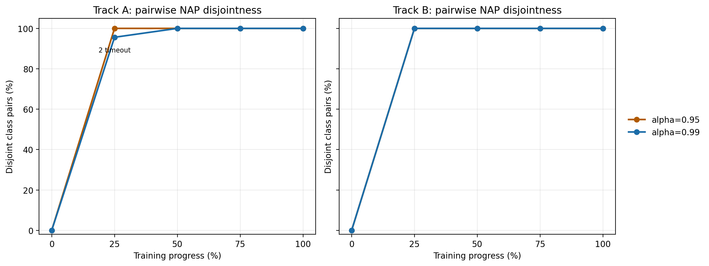
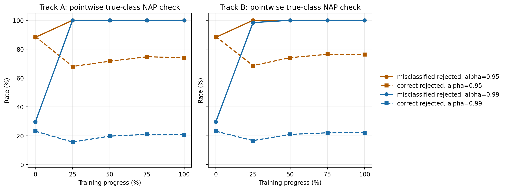
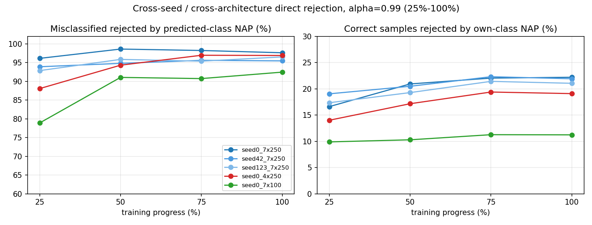
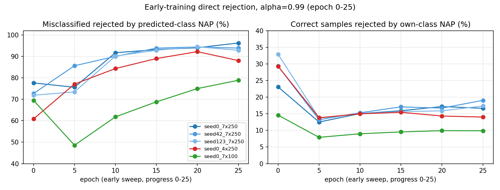
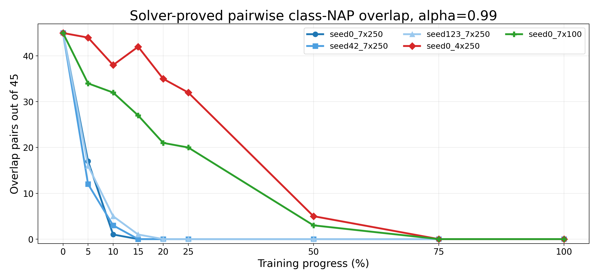

# Part 1: Rejection Evidence for ALWAYS_ON / ALWAYS_OFF NAPs

This note focuses on the rejection side of unary NAP rules, i.e. `ALWAYS_ON` and `ALWAYS_OFF`.

Both experiments in this note use the full-layer unary NAP rule set (`L0-L6`). They are not layer-ablation experiments.

The new experiments separate two questions that were mixed together in the earlier rejection setup:

1. **Pairwise class-NAP separation:** can two different class-specific NAP regions overlap?
2. **Direct misclassification rejection:** does the current class-specific NAP reject samples that the network misclassifies?

Both questions are evaluated across the training trajectory, so the main object is not a single final number. The main object is how the NAP constraints evolve from random initialization to a trained network.

## 1.1 Pairwise Class-NAP Separation

The pairwise experiment checks every pair of MNIST classes. There are `C(10, 2) = 45` class pairs.

For a pair of classes `(i, j)`, the verifier asks whether there exists an input inside the valid MNIST box `[0,1]^784` that satisfies both class `i` NAP constraints and class `j` NAP constraints.

The interpretation is:

| Solver result | Meaning |
| --- | --- |
| `UNSAT` / disjoint | No valid MNIST input can satisfy both class NAPs. The two class-NAP regions are separated. |
| `SAT` / overlap | At least one valid MNIST input satisfies both class NAPs. The two class-NAP regions overlap. |
| `TIMEOUT` | The verifier did not resolve the pair within the time limit. |

The input box matters. The first unbounded version was not the right MNIST-domain query and produced many solver errors. The bounded version uses the natural MNIST input domain `[0,1]^784`.

Data source:

- `generated/step4_pairwise_nap_v2_A/results/pairwise_summary.csv`
- `generated/step4_pairwise_nap_v2_B/results/pairwise_summary.csv`

The result is sharp:

| Track | Alpha | Random init | 25% trained | 50% trained | 75% trained | Final |
| --- | ---: | ---: | ---: | ---: | ---: | ---: |
| A | 0.95 | 0/45 | 45/45 | 45/45 | 45/45 | 45/45 |
| A | 0.99 | 0/45 | 43/45, 2 timeout | 45/45 | 45/45 | 45/45 |
| B | 0.95 | 0/45 | 45/45 | 45/45 | 45/45 | 45/45 |
| B | 0.99 | 0/45 | 45/45 | 45/45 | 45/45 | 45/45 |

This gives a clean training-progress story:

- At random initialization, all class-NAP regions overlap. The NAP constraints do not separate classes yet.
- By 25% training, class-NAP separation is almost complete.
- From 50% training onward, every resolved pair is disjoint in both tracks and both alpha settings.

The correct claim is:

> In the valid MNIST input domain, trained class-specific unary NAP regions become mutually inconsistent across classes.

This is not a robustness theorem for the classifier. It is a domain-level consistency statement about the NAP constraints themselves.

## 1.2 Direct Rejection of Misclassified Samples

The direct rejection experiment checks NAP membership at the sample itself.

For each checkpoint:

1. Run the current network on the MNIST test set.
2. Split samples into correctly classified and misclassified groups.
3. For each misclassified sample, check whether its activation pattern satisfies the NAP of its true class.
4. For comparison, also check how often correctly classified samples are rejected by their own class NAP.

This is not an adversarial `eps`-ball verification task. It is a direct activation-pattern check. Therefore it answers a cleaner question than the old local-region rejection experiment:

> Does the current NAP reject the sample itself?

Data source:

- `generated/nap_rejection_direct.csv`

The most useful comparison is `alpha=0.99`:

| Track | Stage | Misclassified rejected by true-class NAP | Correct samples rejected by own-class NAP |
| --- | --- | ---: | ---: |
| A | random init | 2662/8991 (29.6%) | 233/1009 (23.1%) |
| A | 25% trained | 240/240 (100.0%) | 1518/9760 (15.6%) |
| A | 50% trained | 222/222 (100.0%) | 1926/9778 (19.7%) |
| A | 75% trained | 189/189 (100.0%) | 2047/9811 (20.9%) |
| A | final | 188/188 (100.0%) | 2025/9812 (20.6%) |
| B | random init | 2662/8991 (29.6%) | 233/1009 (23.1%) |
| B | 25% trained | 254/258 (98.4%) | 1618/9742 (16.6%) |
| B | 50% trained | 215/215 (100.0%) | 2048/9785 (20.9%) |
| B | 75% trained | 169/169 (100.0%) | 2167/9831 (22.0%) |
| B | final | 168/168 (100.0%) | 2183/9832 (22.2%) |

The interpretation is:

- At random initialization, `alpha=0.99` barely separates misclassified samples from correct samples: 29.6% rejection vs 23.1% false rejection.
- After training starts, the true-class NAP rejects almost all misclassified samples.
- The correct-sample rejection rate remains nonzero, around 15.6-22.2% after training, so this should not be described as a zero-false-positive rule.

For `alpha=0.95`, the rejection rate on misclassified samples is also very high, but it is too strict:

| Setting | Misclassified rejected by true-class NAP | Correct samples rejected by own-class NAP |
| --- | ---: | ---: |
| Track A, 25%-final | 240/240 to 188/188 (100.0%) | 6636/9760 to 7266/9812 (68.0-74.7%) |
| Track B, 25%-final | 258/258 to 168/168 (100.0%) | 6680/9742 to 7506/9832 (68.6-76.4%) |

So the cleaner rejection conclusion is:

> After training, unary NAP constraints become highly inconsistent with misclassified samples. The useful rejection setting is closer to `alpha=0.99`, because `alpha=0.95` rejects too many correctly classified samples as well.

## 1.3 Cross-seed and Cross-architecture Direct Rejection

The two experiments above use Track A and Track B, which are two training runs of the same `7x250` architecture. A natural follow-up question is whether the direct rejection phenomenon depends on the random seed or on the network architecture.

This section uses a separate sweep that covers five models:

| Run key | Seed | Hidden layers | Hidden width |
| --- | --- | --- | --- |
| `seed0_7x250` | 0 | 7 | 250 |
| `seed42_7x250` | 42 | 7 | 250 |
| `seed123_7x250` | 123 | 7 | 250 |
| `seed0_4x250` | 0 | 4 | 250 |
| `seed0_7x100` | 0 | 7 | 100 |

For each model, the same direct rejection check is evaluated at progress 0%, 25%, 50%, 75%, 100% (full sweep), and additionally at epochs 5, 10, 15, 20, 25 (early sweep) to resolve the random-init to 25%-training transition.

The rejection metric here is `mis_rej_pred_pct`, i.e. the fraction of misclassified samples that violate the NAP of the **predicted** class. This matches the practical rejection scenario where the true label is unknown at inference.

Data sources:

- `Random_Initialized_NN/generated/nap_generalization_alpha_sweep/results/direct_rejection_summary.csv`
- `Random_Initialized_NN/generated/nap_generalization_early_0_25_alpha_sweep/results/direct_rejection_summary.csv`

### Full sweep, alpha=0.99

| Model | 25% pred-rej | 50% | 75% | 100% | 25% correct-rej | 50% | 75% | 100% |
| --- | ---: | ---: | ---: | ---: | ---: | ---: | ---: | ---: |
| `seed0_7x250` | 96.12% | 98.60% | 98.23% | 97.62% | 16.61% | 20.93% | 22.04% | 22.20% |
| `seed42_7x250` | 93.89% | 94.79% | 95.60% | 95.46% | 19.05% | 20.48% | 22.31% | 21.92% |
| `seed123_7x250` | 92.86% | 95.85% | 95.38% | 96.51% | 17.35% | 19.28% | 21.42% | 21.05% |
| `seed0_4x250` | 88.06% | 94.30% | 96.95% | 96.89% | 14.01% | 17.16% | 19.39% | 19.09% |
| `seed0_7x100` | 78.89% | 91.05% | 90.73% | 92.45% | 9.89% | 10.29% | 11.26% | 11.23% |

### Early sweep, alpha=0.99 (epoch 0-25)

| Model | epoch 0 | 5 | 10 | 15 | 20 | 25 |
| --- | ---: | ---: | ---: | ---: | ---: | ---: |
| `seed0_7x250` | 77.66% | 75.60% | 91.73% | 93.18% | 94.05% | 96.26% |
| `seed42_7x250` | 72.69% | 85.64% | 90.04% | 93.86% | 94.42% | 93.89% |
| `seed123_7x250` | 71.89% | 73.46% | 90.17% | 92.89% | 94.47% | 92.86% |
| `seed0_4x250` | 60.83% | 77.10% | 84.35% | 89.00% | 92.23% | 88.06% |
| `seed0_7x100` | 69.55% | 48.57% | 61.82% | 68.81% | 75.00% | 78.89% |

Takeaways:

- Across three `7x250` seeds, predicted-class rejection is consistent: after 25% training, all three sit in the `92.9%-96.3%` band, and from 50% onward in the `94.8%-98.6%` band.
- The smaller `4x250` network starts lower at 25% (`88.1%`) but catches up by 75%-100%, where it matches the `7x250` band.
- The narrower `7x100` network is visibly weaker at every stage: at 25% only `78.9%`, and at 100% still `92.5%`, below any `7x250` seed.
- In the early sweep, the `7x250` models take the main jump between epoch 5 and epoch 10 (from roughly `75-85%` to about `90%`), and stabilize by epoch 15-20. `4x250` follows the same shape but later; `7x100` is slower and still climbing at epoch 25.
- Correct-sample rejection shows a smaller but related pattern: `7x250` carries a `16-22%` false-rejection rate at alpha=0.99, `4x250` sits at `14-19%`, and `7x100` at `10-11%`. This confirms that `alpha=0.99` is a consistency/anomaly signal rather than a zero-false-positive acceptance rule, and that the trade-off changes with architecture.

A single-line summary:

> After 25% training, predicted-class NAP rejection is consistent across 7x250 seeds at about 93-97%. The same phenomenon appears across architectures, but with weaker strength for 7x100 and delayed emergence for 4x250.

## 1.4 Cross-seed and Cross-architecture Pairwise Overlap

The pairwise experiment is extended to the same five models. To make the evolution visible across the whole trajectory, the 0-25 early sweep and the 25-100 full sweep are combined.

Data sources:

- `Random_Initialized_NN/generated/nap_generalization_alpha_sweep/results/pairwise_summary.csv`
- `Random_Initialized_NN/generated/nap_generalization_early_0_25_alpha_sweep/results/pairwise_summary.csv`

The figure below shows only `overlap` pairs, i.e. class pairs for which Marabou returned SAT and therefore proved that the two class-NAP regions intersect. Each model has 45 possible class pairs. Lower is better; zero means no solver-proved overlap remains. Timeout cases are not mixed into the plot and are reported separately in the tables below.

### Aggregate across all 5 models (225 pairs per cell), `alpha=0.99`

| Progress | overlap / 225 | timeout / 225 | disjoint / 225 |
| ---: | ---: | ---: | ---: |
| 0 | 225 | 0 | 0 |
| 5 | 123 | 48 | 54 |
| 10 | 79 | 69 | 77 |
| 15 | 70 | 40 | 114 (+1 missing) |
| 20 | 56 | 31 | 138 |
| 25 | 52 | 25 | 148 |
| 50 | 8 | 50 | 167 |
| 75 | 0 | 31 | 194 |
| 100 | 0 | 31 | 190 (+4 missing) |

### Per-model overlap / timeout, `alpha=0.99` (out of 45 pairs)

| Model | 0 | 5 | 10 | 15 | 20 | 25 | 50 | 75 | 100 |
| --- | --- | --- | --- | --- | --- | --- | --- | --- | --- |
| `seed0_7x250` | 45 / 0 | 17 / 10 | 1 / 18 | 0 / 5 | 0 / 0 | 0 / 0 | 0 / 0 | 0 / 0 | 0 / 0 |
| `seed42_7x250` | 45 / 0 | 12 / 11 | 3 / 17 | 0 / 9 | 0 / 2 | 0 / 0 | 0 / 0 | 0 / 0 | 0 / 0 |
| `seed123_7x250` | 45 / 0 | 16 / 20 | 5 / 23 | 1 / 15 | 0 / 7 | 0 / 2 | 0 / 0 | 0 / 0 | 0 / 0 |
| `seed0_4x250` | 45 / 0 | 44 / 1 | 38 / 6 | 42 / 1 (+1 missing) | 35 / 9 | 32 / 12 | 5 / 31 | 0 / 28 | 0 / 26 (+4 missing) |
| `seed0_7x100` | 45 / 0 | 34 / 6 | 32 / 5 | 27 / 10 | 21 / 13 | 20 / 11 | 3 / 19 | 0 / 3 | 0 / 5 |

Takeaways:

- For the three `7x250` models, class-NAP overlap vanishes very early. All three have zero solver-proved overlap from epoch 20 onward at `alpha=0.99`.
- For `4x250` and `7x100`, overlap persists much further into training. Both still have nonzero overlap at epoch 50 (5 and 3 pairs respectively) and only have zero solver-proved overlap by epoch 75.
- Even at 75%-100% training, `4x250` and `7x100` still carry timeout pairs. `timeout` is not the same as `overlap`; it means the solver did not decide, not that overlap exists. The correct claim is "no proven overlap", not "all pairs proven disjoint".
- For `alpha=0.95` (stricter NAP), solver-proved overlap reaches zero faster across all models: the aggregate is 4/225 at 25% and 0/225 from 50% onward. This is expected, since a stricter NAP region is smaller and easier to prove disjoint, but must be read together with the higher correct-sample rejection rate reported in the direct rejection checks above.

A single-line summary:

> For 7x250 networks, no solver-proved class-NAP overlap remains by epoch 20 at alpha=0.99. For smaller or narrower networks, overlap persists through epoch 50 and only reaches zero solver-proved overlap by epoch 75, with some timeout cases still unresolved.

## Combined Reading

The four sub-experiments above support the same training-progress story from different angles.

Pairwise separation, including the cross-model extension, says:

> different class NAPs become mutually inconsistent in the valid input domain, and the rate at which this happens depends on architecture capacity.

Direct rejection says:

> the original true-class check shows that misclassified samples increasingly violate their true-class NAP; the cross-model follow-up uses the practical predicted-class metric and shows that wrong-predicted samples increasingly violate the NAP of the class they were predicted into.

Together, they show that the learned NAP rules do not merely increase verification rates. They become class-specific exclusion constraints as training progresses, and the phenomenon is not a quirk of a single seed or a single architecture.
