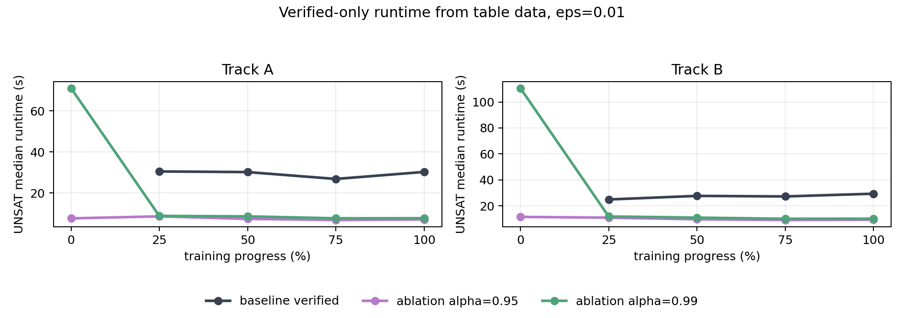
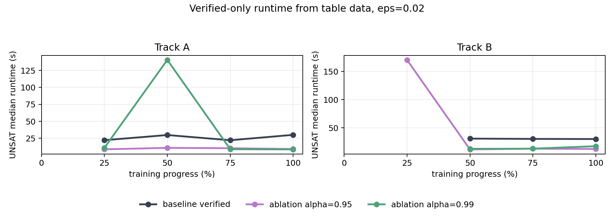

# Step 4 — Unary ON/OFF Layer Ablation

> Preview update for the `Random_to_welltrained` reports
> Marabou exact results only

- **NAP family:** unary `ALWAYS_ON / ALWAYS_OFF`
- **Tracks:** A and B
- **Checkpoints per track:** 5 (`0%, 25%, 50%, 75%, 100%`)
- **Positive refs per checkpoint:** 20 fixed refs (selected from checkpoints with progress >= 25%; see below)
- **Layer configs:** `baseline` (no NAP), `last1` through `last7`
- **Runtime alpha:** `0.95`, `0.99` (not applicable to baseline)
- **Epsilon:** `0.01`, `0.02`, `0.05`
- **Solver encoding (ablation):** single disjunctive misclassification constraint per query, 600s timeout
- **Solver encoding (baseline):** per-target-class solving, 300s per target, up to 2700s total (from `step4_marabou_v2`)

Layer configs:

| Config | Layers used |
|--------|-------------|
| `last1` | `L6` only |
| `last2` | `L5-L6` |
| `last3` | `L4-L6` |
| `last4` | `L3-L6` |
| `last5` | `L2-L6` |
| `last6` | `L1-L6` |
| `last7` | `L0-L6`, all unary rules |

Data sources:

- `generated/step4_unary_ablation_full_A/results/coverage.csv` (layer ablation)
- `generated/step4_unary_ablation_full_B/results/coverage.csv` (layer ablation)
- `generated/step4_marabou_v2/results/coverage.csv` (baseline, same fixed refs)

Track A has 3 missing verify tasks out of 4200. They are all at `eps=0.02`, progress `50%`, and do not affect the `eps=0.01` conclusions.

### Reference selection

The 20 fixed refs per track are selected by `step4_unified_refs.py`:

1. Exclude `epoch_000` (random init, progress < 25%) from the intersection.
2. Take MNIST test samples that are correctly classified by **all** remaining checkpoints (25%, 50%, 75%, 100%).
3. Rank by dataset index and select the first 20.

Because `epoch_000` is not part of the intersection, the random-init checkpoint misclassifies 15/20 refs in both tracks. Only 5 refs are eligible for verification at `epoch_000`. For all checkpoints with progress >= 25%, misclassified = 0 and all 20 refs are eligible.

**The main tables below show only progress >= 25%.** The `epoch_000` row is included in a separate appendix for completeness.

### Solver encoding note

This ablation uses a **single disjunctive constraint** encoding (all 9 target classes in one query, 600s total timeout). The earlier `step4_marabou.py` used **per-target-class solving** (up to 9 separate queries, 300s each, up to 2700s total). This means some cases that were resolved as adversarial in the old solver may appear as timeout here. The tables below use the 600s full ablation run.

---

## 1. How to Read the Tables

Each table cell is:

> `genuine / verified / timeout`

where:

- **genuine**: verified AND non-vacuous (the strongest result);
- **verified**: Marabou returned UNSAT for the adversarial query, including vacuous cases;
- **timeout**: Marabou did not return a final answer within 600s.

The denominator is always 20 fixed refs. An asterisk `*` marks a row with one missing verification task. For example, `1/1/18*` means 1 genuine proof, 1 total UNSAT proof, 18 timeouts, and 1 missing task. It does **not** mean an adversarial example was found. When adversarial counterexamples are found, `N=<count>` is appended to the cell.

For baseline (no NAP constraints), genuine = verified always (no vacuity possible). Baseline data comes from `step4_marabou_v2` which uses per-target encoding (up to 2700s).

**No adversarial counterexamples (SAT) were returned** in the layer-ablation configs under the 600s disjunctive encoding. All non-verified eligible cases are timeouts. However, the baseline (per-target solver, up to 2700s) found adversarial cases at `eps=0.02` and `eps=0.05`. Therefore, "no SAT returned" in ablation configs should not be read as "no adversarial examples exist"; it reflects the solver timeout limit.

---

## 2. Aggregated Final-Checkpoint Reading

### `eps=0.01`

| Config | Track A, `alpha=0.95` | Track A, `alpha=0.99` | Track B, `alpha=0.95` | Track B, `alpha=0.99` |
|--------|----------------------:|----------------------:|----------------------:|----------------------:|
| baseline | 17/17/3 | — | 18/18/2 | — |
| `last1` | 17/18/2 | 18/18/2 | 20/20/0 | 20/20/0 |
| `last4` | 18/19/1 | 19/19/1 | 19/20/0 | 20/20/0 |
| `last7` | 9/19/1 | 19/19/1 | 10/20/0 | 20/20/0 |

### Direct reading

- Baseline (no NAP) at the final checkpoint verifies `17/20` (Track A) and `18/20` (Track B). Adding even `last1` NAP at `alpha=0.99` matches or exceeds this.
- At `alpha=0.99`, `last1` is already close to `last7`: final genuine is `18/20` vs `19/20` on Track A, and `20/20` vs `20/20` on Track B.
- At `alpha=0.95`, full-network `last7` is misleading if vacuous cases are counted: Track A is `9/19/1`, Track B is `10/20/0`.
- The clean small-radius setting is therefore not simply "use more layers"; it is closer to "use high-confidence deep rules."

### `eps=0.02`

| Config | Track A, `alpha=0.95` | Track A, `alpha=0.99` | Track B, `alpha=0.95` | Track B, `alpha=0.99` |
|--------|----------------------:|----------------------:|----------------------:|----------------------:|
| baseline | 3/3/17 | — | 4/4/16 | — |
| `last1` | 3/3/17 | 3/3/17 | 5/5/15 | 4/4/16 |
| `last2` | 3/3/17 | 3/3/17 | 5/5/15 | 5/5/15 |
| `last4` | 7/7/13 | 5/5/15 | 7/8/12 | 7/7/13 |
| `last7` | 6/10/10 | 3/3/17 | 10/12/8 | 5/5/15 |

### Direct reading

- Baseline at `eps=0.02` final: `3/3/17` (A) and `4/4/16` (B). Most NAP configs match or exceed this.
- `eps=0.02` is much harder than `eps=0.01`.
- `last1` and `last2` do not fail because Marabou finds adversarial examples. They fail by timeout under this solver configuration.
- Mid-to-late layer sets, especially `last4`, can help at `eps=0.02`.
- The result is less clean than `eps=0.01`; it does not support a universal "last layer only" rule.
- Note: the baseline per-target solver found adversarial at `eps=0.02` (A 75%: N=2, B 50%: N=1) but these do not appear in the final checkpoint row.

---

## 3. `eps=0.01`: Verified vs Genuine (progress >= 25%)

### Exact checkpoint tables

#### Track A

| Progress | baseline | `last1` (0.95) | `last1` (0.99) | `last4` (0.95) | `last4` (0.99) | `last7` (0.95) | `last7` (0.99) |
|----------|--------:|--------:|--------:|--------:|--------:|--------:|--------:|
| 25% | 15/15/5 | 18/18/2 | 15/15/5 | 16/19/1 | 15/15/5 | 10/19/1 | 15/16/4 |
| 50% | 15/15/5 | 17/17/3 | 15/15/5 | 18/19/1 | 16/16/4 | 12/19/1 | 16/17/3 |
| 75% | 17/17/3 | 17/18/2 | 18/18/2 | 18/19/1 | 18/18/2 | 8/19/1 | 19/19/1 |
| 100% | 17/17/3 | 17/18/2 | 18/18/2 | 18/19/1 | 19/19/1 | 9/19/1 | 19/19/1 |

Full Track A tables (all layer configs)

**Track A, `alpha=0.95`**

| Progress | baseline | `last1` | `last2` | `last3` | `last4` | `last5` | `last6` | `last7` |
|----------|--------:|--------:|--------:|--------:|--------:|--------:|--------:|--------:|
| 25% | 15/15/5 | 18/18/2 | 15/16/4 | 16/19/1 | 16/19/1 | 16/19/1 | 11/19/1 | 10/19/1 |
| 50% | 15/15/5 | 17/17/3 | 16/17/3 | 18/19/1 | 18/19/1 | 17/19/1 | 13/19/1 | 12/19/1 |
| 75% | 17/17/3 | 17/18/2 | 17/18/2 | 18/19/1 | 18/19/1 | 17/20/0 | 13/19/1 | 8/19/1 |
| 100% | 17/17/3 | 17/18/2 | 17/18/2 | 18/19/1 | 18/19/1 | 17/19/1 | 14/19/1 | 9/19/1 |

**Track A, `alpha=0.99`**

| Progress | baseline | `last1` | `last2` | `last3` | `last4` | `last5` | `last6` | `last7` |
|----------|--------:|--------:|--------:|--------:|--------:|--------:|--------:|--------:|
| 25% | 15/15/5 | 15/15/5 | 15/15/5 | 15/15/5 | 15/15/5 | 15/15/5 | 15/16/4 | 15/16/4 |
| 50% | 15/15/5 | 15/15/5 | 16/16/4 | 17/17/3 | 16/16/4 | 16/16/4 | 17/17/3 | 16/17/3 |
| 75% | 17/17/3 | 18/18/2 | 18/18/2 | 18/18/2 | 18/18/2 | 19/19/1 | 19/19/1 | 19/19/1 |
| 100% | 17/17/3 | 18/18/2 | 18/18/2 | 18/18/2 | 19/19/1 | 19/19/1 | 19/19/1 | 19/19/1 |

#### Track B

| Progress | baseline | `last1` (0.95) | `last1` (0.99) | `last4` (0.95) | `last4` (0.99) | `last7` (0.95) | `last7` (0.99) |
|----------|--------:|--------:|--------:|--------:|--------:|--------:|--------:|
| 25% | 14/14/6 | 15/16/4 | 13/14/6 | 14/17/3 | 14/14/6 | 11/18/2 | 13/14/6 |
| 50% | 16/16/4 | 16/17/3 | 17/17/3 | 17/18/2 | 18/18/2 | 9/19/1 | 17/17/3 |
| 75% | 18/18/2 | 20/20/0 | 20/20/0 | 19/20/0 | 20/20/0 | 10/20/0 | 20/20/0 |
| 100% | 18/18/2 | 20/20/0 | 20/20/0 | 19/20/0 | 20/20/0 | 10/20/0 | 20/20/0 |

Full Track B tables (all layer configs)

**Track B, `alpha=0.95`**

| Progress | baseline | `last1` | `last2` | `last3` | `last4` | `last5` | `last6` | `last7` |
|----------|--------:|--------:|--------:|--------:|--------:|--------:|--------:|--------:|
| 25% | 14/14/6 | 15/16/4 | 15/16/4 | 15/16/4 | 14/17/3 | 14/18/2 | 12/18/2 | 11/18/2 |
| 50% | 16/16/4 | 16/17/3 | 17/18/2 | 17/18/2 | 17/18/2 | 16/19/1 | 14/19/1 | 9/19/1 |
| 75% | 18/18/2 | 20/20/0 | 19/20/0 | 19/20/0 | 19/20/0 | 18/20/0 | 12/20/0 | 10/20/0 |
| 100% | 18/18/2 | 20/20/0 | 19/20/0 | 19/20/0 | 19/20/0 | 18/20/0 | 12/20/0 | 10/20/0 |

**Track B, `alpha=0.99`**

| Progress | baseline | `last1` | `last2` | `last3` | `last4` | `last5` | `last6` | `last7` |
|----------|--------:|--------:|--------:|--------:|--------:|--------:|--------:|--------:|
| 25% | 14/14/6 | 13/14/6 | 14/14/6 | 14/14/6 | 14/14/6 | 14/14/6 | 14/14/6 | 13/14/6 |
| 50% | 16/16/4 | 17/17/3 | 17/17/3 | 18/18/2 | 18/18/2 | 17/17/3 | 17/17/3 | 17/17/3 |
| 75% | 18/18/2 | 20/20/0 | 20/20/0 | 20/20/0 | 20/20/0 | 20/20/0 | 20/20/0 | 20/20/0 |
| 100% | 18/18/2 | 20/20/0 | 20/20/0 | 20/20/0 | 20/20/0 | 20/20/0 | 20/20/0 | 20/20/0 |

### Direct reading

- Baseline at final: `17/17/3` (A) and `18/18/2` (B). No vacuity by definition.
- At `alpha=0.99`, even `last1` matches or exceeds baseline genuine rate.
- At `alpha=0.95`, adding more layers inflates verified through vacuity: Track A final `last7` is `9/19/1` (genuine 9 < baseline 17).
- At `alpha=0.99`, vacuity is much smaller, so `genuine` and `verified` are nearly identical across all configs.

---

## 4. `eps=0.02`: Verified vs Genuine (progress >= 25%)

### Exact checkpoint tables

#### Track A

| Progress | baseline | `last1` (0.95) | `last1` (0.99) | `last4` (0.95) | `last4` (0.99) | `last7` (0.95) | `last7` (0.99) |
|----------|--------:|--------:|--------:|--------:|--------:|--------:|--------:|
| 25% | 1/1/19 | 1/1/19 | 1/1/19 | 2/2/18 | 1/1/19 | 0/2/18 | 0/0/20 |
| 50% | 3/3/17 | 1/1/18* | 1/1/19 | 6/6/14 | 3/3/17 | 3/7/13 | 1/1/18* |
| 75% | 3/3/15, N=2 | 3/3/17 | 3/3/17 | 6/6/14 | 5/5/15 | 4/8/12 | 3/3/17 |
| 100% | 3/3/17 | 3/3/17 | 3/3/17 | 7/7/13 | 5/5/15 | 6/10/10 | 3/3/17 |

Full Track A tables (all layer configs)

**Track A, `alpha=0.95`**

| Progress | baseline | `last1` | `last2` | `last3` | `last4` | `last5` | `last6` | `last7` |
|----------|--------:|--------:|--------:|--------:|--------:|--------:|--------:|--------:|
| 25% | 1/1/19 | 1/1/19 | 1/1/19 | 1/1/19 | 2/2/18 | 0/0/20 | 1/1/19 | 0/2/18 |
| 50% | 3/3/17 | 1/1/18* | 3/3/16* | 4/5/15 | 6/6/14 | 4/4/16 | 2/3/17 | 3/7/13 |
| 75% | 3/3/15, N=2 | 3/3/17 | 4/4/16 | 6/6/14 | 6/6/14 | 7/7/13 | 4/4/16 | 4/8/12 |
| 100% | 3/3/17 | 3/3/17 | 3/3/17 | 6/6/14 | 7/7/13 | 7/7/13 | 6/6/14 | 6/10/10 |

**Track A, `alpha=0.99`**

| Progress | baseline | `last1` | `last2` | `last3` | `last4` | `last5` | `last6` | `last7` |
|----------|--------:|--------:|--------:|--------:|--------:|--------:|--------:|--------:|
| 25% | 1/1/19 | 1/1/19 | 1/1/19 | 1/1/19 | 1/1/19 | 0/0/20 | 0/0/20 | 0/0/20 |
| 50% | 3/3/17 | 1/1/19 | 1/1/19 | 1/1/19 | 3/3/17 | 1/1/19 | 0/0/20 | 1/1/18* |
| 75% | 3/3/15, N=2 | 3/3/17 | 3/3/17 | 3/3/17 | 5/5/15 | 3/3/17 | 3/3/17 | 3/3/17 |
| 100% | 3/3/17 | 3/3/17 | 3/3/17 | 3/3/17 | 5/5/15 | 4/4/16 | 2/2/18 | 3/3/17 |

#### Track B

| Progress | baseline | `last1` (0.95) | `last1` (0.99) | `last4` (0.95) | `last4` (0.99) | `last7` (0.95) | `last7` (0.99) |
|----------|--------:|--------:|--------:|--------:|--------:|--------:|--------:|
| 25% | 0/0/20 | 0/0/20 | 0/0/20 | 1/1/19 | 0/0/20 | 1/3/17 | 0/0/20 |
| 50% | 3/3/16, N=1 | 3/3/17 | 3/3/17 | 6/6/14 | 6/6/14 | 5/9/11 | 2/2/18 |
| 75% | 4/4/16 | 5/5/15 | 4/4/16 | 8/9/11 | 6/6/14 | 7/9/11 | 4/4/16 |
| 100% | 4/4/16 | 5/5/15 | 4/4/16 | 7/8/12 | 7/7/13 | 10/12/8 | 5/5/15 |

Full Track B tables (all layer configs)

**Track B, `alpha=0.95`**

| Progress | baseline | `last1` | `last2` | `last3` | `last4` | `last5` | `last6` | `last7` |
|----------|--------:|--------:|--------:|--------:|--------:|--------:|--------:|--------:|
| 25% | 0/0/20 | 0/0/20 | 0/0/20 | 0/0/20 | 1/1/19 | 1/1/19 | 0/1/19 | 1/3/17 |
| 50% | 3/3/16, N=1 | 3/3/17 | 4/4/16 | 6/6/14 | 6/6/14 | 7/7/13 | 2/4/16 | 5/9/11 |
| 75% | 4/4/16 | 5/5/15 | 5/5/15 | 5/6/14 | 8/9/11 | 11/12/8 | 8/10/10 | 7/9/11 |
| 100% | 4/4/16 | 5/5/15 | 5/5/15 | 5/5/15 | 7/8/12 | 8/8/12 | 9/11/9 | 10/12/8 |

**Track B, `alpha=0.99`**

| Progress | baseline | `last1` | `last2` | `last3` | `last4` | `last5` | `last6` | `last7` |
|----------|--------:|--------:|--------:|--------:|--------:|--------:|--------:|--------:|
| 25% | 0/0/20 | 0/0/20 | 0/0/20 | 0/0/20 | 0/0/20 | 0/0/20 | 0/0/20 | 0/0/20 |
| 50% | 3/3/16, N=1 | 3/3/17 | 3/3/17 | 4/4/16 | 6/6/14 | 4/4/16 | 1/1/19 | 2/2/18 |
| 75% | 4/4/16 | 4/4/16 | 5/5/15 | 6/6/14 | 6/6/14 | 4/4/16 | 1/1/19 | 4/4/16 |
| 100% | 4/4/16 | 4/4/16 | 5/5/15 | 6/6/14 | 7/7/13 | 5/5/15 | 4/4/16 | 5/5/15 |

### Direct reading

- Baseline at `eps=0.02` found adversarial counterexamples at intermediate checkpoints (A 75%: N=2, B 50%: N=1). These are real SAT results from the per-target solver (2700s budget).
- The ablation configs (600s disjunctive) found zero adversarial; all non-verified cases are timeouts under this encoding and budget.
- Track A final `last1/last2` are only `3/3/17` for both alphas, matching baseline.
- Track B final `last1/last2` are stronger, but still only `4-5` genuine out of 20.
- The best final rows are from deeper subsets:
  - Track A: `last4` or `last5`, up to `7/7/13` at `alpha=0.95`;
  - Track B: `last7` reaches `10/12/8` at `alpha=0.95`, while `last4` reaches `7/7/13` at `alpha=0.99`.

---

## 5. `eps=0.05`

At `eps=0.05`, both genuine and verified are always zero across all checkpoints (progress >= 25%), both alphas, and all layer configs (including baseline).

All non-verified cases are timeouts, except baseline at B 75% which found 2 adversarial (N=2). The current Marabou setup cannot resolve useful certificates at this radius.

---

## 6. Solver Encoding Comparison

Two solver encodings are used in this report on the same 20 fixed refs:

| Aspect | Ablation (last1-last7) | Baseline (from `step4_marabou_v2`) |
|--------|--------------|-------------------|
| Encoding | Single disjunction (all 9 targets) | Per-target-class (up to 9 separate queries) |
| Timeout | 600s per query | 300s per target (up to 2700s total) |
| Adversarial found | 0 | 6 (at eps=0.02 and eps=0.05) |

The 6 baseline adversarial cases all required > 600s of solver time (875s to 3070s). This confirms that the ablation's 600s budget is too short to find these adversarial counterexamples. The ablation timeouts at `eps=0.02` are not evidence of absence — they are evidence of insufficient solver time.

## 7. Appendix: `epoch_000` (random init)

At `epoch_000`, 15/20 fixed refs are misclassified by the random-init model (the refs were selected from trained checkpoints). Only 5 refs are eligible for positive-ref verification.

Among those 5 eligible refs at `eps=0.01`:

| Config range | Track A, `alpha=0.95` | Track A, `alpha=0.99` | Track B, `alpha=0.95` | Track B, `alpha=0.99` |
|-------------|----------------------:|----------------------:|----------------------:|----------------------:|
| `last1-last2` | 0/0/5 | 0/0/5 | 0/0/5 | 0/0/5 |
| `last3` | 1/1/4 | 1/1/4 | 1/1/4 | 0/0/5 |
| `last4` | 5/5/0 | 4/4/1 | 5/5/0 | 3/3/2 |
| `last5-last7` | 3-5/5/0 | 5/5/0 | 3-5/5/0 | 5/5/0 |

At `eps=0.02` and `eps=0.05`, all 5 eligible refs timeout across all configs at `epoch_000`.

---

## 8. Time Consumption of Verified Proofs

Runtime statistics are computed from:

- `generated/step4_marabou_v2/results/verify_all.csv` (baseline, per-target solver)
- `generated/step4_unary_ablation_full_A/results/verify/*.json`
- `generated/step4_unary_ablation_full_B/results/verify/*.json`

The figures plot only verified/UNSAT median runtime, using the same rows as the tables below. For baseline, timeout and adversarial runtimes are intentionally not reported here because the baseline uses a different per-target encoding and can run up to 2700s; those entries are marked as `—`. For the layer-ablation rows, the `overall` columns are still shown to indicate how timeout-dominated the 600s disjunctive runs are.

The CSV version of these tables is saved as:

- `markdown/step4_followup_assets/layer_ablation_600s_verified_time_eps001_eps002_with_baseline.csv`

### `eps=0.01`

| Method | Track | Checkpoint | Progress | Alpha | UNSAT n | UNSAT mean | UNSAT median | SAT n | SAT mean | SAT median | Overall n | Overall mean | Overall median |
|---|---|---|---:|---:|---:|---:|---:|---:|---:|---:|---:|---:|---:|
| baseline | A | `epoch_000` | 0% | — | 0 | — | — | — | — | — | — | — | — |
| baseline | A | `epoch_018` | 25% | — | 15 | 32.92s | 30.52s | — | — | — | — | — | — |
| baseline | A | `epoch_035` | 50% | — | 15 | 33.26s | 30.21s | — | — | — | — | — | — |
| baseline | A | `epoch_052` | 75% | — | 17 | 31.00s | 26.86s | — | — | — | — | — | — |
| baseline | A | `epoch_070` | 100% | — | 17 | 31.35s | 30.28s | — | — | — | — | — | — |
| baseline | B | `epoch_000` | 0% | — | 0 | — | — | — | — | — | — | — | — |
| baseline | B | `epoch_025` | 25% | — | 14 | 26.01s | 24.92s | — | — | — | — | — | — |
| baseline | B | `epoch_050` | 50% | — | 16 | 27.21s | 27.68s | — | — | — | — | — | — |
| baseline | B | `epoch_075` | 75% | — | 18 | 26.55s | 27.25s | — | — | — | — | — | — |
| baseline | B | `epoch_100` | 100% | — | 18 | 27.52s | 29.35s | — | — | — | — | — | — |
| layer ablation | A | `epoch_000` | 0% | 0.95 | 21 | 40.10s | 7.65s | 0 | — | — | 35 | 280.66s | 82.25s |
| layer ablation | A | `epoch_000` | 0% | 0.99 | 20 | 99.56s | 71.10s | 0 | — | — | 35 | 328.50s | 91.06s |
| layer ablation | A | `epoch_018` | 25% | 0.95 | 129 | 45.03s | 8.63s | 0 | — | — | 140 | 88.79s | 8.78s |
| layer ablation | A | `epoch_018` | 25% | 0.99 | 107 | 12.63s | 8.84s | 0 | — | — | 140 | 152.83s | 9.96s |
| layer ablation | A | `epoch_035` | 50% | 0.95 | 129 | 21.09s | 7.40s | 0 | — | — | 140 | 66.73s | 7.65s |
| layer ablation | A | `epoch_035` | 50% | 0.99 | 114 | 28.17s | 8.62s | 0 | — | — | 140 | 135.15s | 8.89s |
| layer ablation | A | `epoch_052` | 75% | 0.95 | 132 | 14.94s | 6.86s | 0 | — | — | 140 | 48.57s | 6.96s |
| layer ablation | A | `epoch_052` | 75% | 0.99 | 129 | 18.90s | 7.68s | 0 | — | — | 140 | 64.69s | 8.04s |
| layer ablation | A | `epoch_070` | 100% | 0.95 | 131 | 10.98s | 7.12s | 0 | — | — | 140 | 49.14s | 7.24s |
| layer ablation | A | `epoch_070` | 100% | 0.99 | 130 | 19.32s | 7.72s | 0 | — | — | 140 | 60.99s | 8.02s |
| layer ablation | B | `epoch_000` | 0% | 0.95 | 21 | 59.34s | 11.50s | 0 | — | — | 35 | 300.04s | 145.66s |
| layer ablation | B | `epoch_000` | 0% | 0.99 | 18 | 94.34s | 110.63s | 0 | — | — | 35 | 369.88s | 151.00s |
| layer ablation | B | `epoch_025` | 25% | 0.95 | 119 | 32.42s | 10.90s | 0 | — | — | 140 | 119.84s | 11.54s |
| layer ablation | B | `epoch_025` | 25% | 0.99 | 98 | 29.78s | 11.83s | 0 | — | — | 140 | 201.89s | 12.85s |
| layer ablation | B | `epoch_050` | 50% | 0.95 | 128 | 18.92s | 9.64s | 0 | — | — | 140 | 69.29s | 10.02s |
| layer ablation | B | `epoch_050` | 50% | 0.99 | 121 | 30.10s | 10.94s | 0 | — | — | 140 | 107.94s | 11.27s |
| layer ablation | B | `epoch_075` | 75% | 0.95 | 140 | 13.30s | 9.12s | 0 | — | — | 140 | 13.30s | 9.12s |
| layer ablation | B | `epoch_075` | 75% | 0.99 | 140 | 21.82s | 10.06s | 0 | — | — | 140 | 21.82s | 10.06s |
| layer ablation | B | `epoch_100` | 100% | 0.95 | 140 | 12.98s | 9.30s | 0 | — | — | 140 | 12.98s | 9.30s |
| layer ablation | B | `epoch_100` | 100% | 0.99 | 140 | 18.06s | 10.12s | 0 | — | — | 140 | 18.06s | 10.12s |

### `eps=0.02`

| Method | Track | Checkpoint | Progress | Alpha | UNSAT n | UNSAT mean | UNSAT median | SAT n | SAT mean | SAT median | Overall n | Overall mean | Overall median |
|---|---|---|---:|---:|---:|---:|---:|---:|---:|---:|---:|---:|---:|
| baseline | A | `epoch_000` | 0% | — | 0 | — | — | — | — | — | — | — | — |
| baseline | A | `epoch_018` | 25% | — | 1 | 22.22s | 22.22s | — | — | — | — | — | — |
| baseline | A | `epoch_035` | 50% | — | 3 | 29.41s | 29.81s | — | — | — | — | — | — |
| baseline | A | `epoch_052` | 75% | — | 3 | 24.72s | 22.14s | — | — | — | — | — | — |
| baseline | A | `epoch_070` | 100% | — | 3 | 27.78s | 30.06s | — | — | — | — | — | — |
| baseline | B | `epoch_000` | 0% | — | 0 | — | — | — | — | — | — | — | — |
| baseline | B | `epoch_025` | 25% | — | 0 | — | — | — | — | — | — | — | — |
| baseline | B | `epoch_050` | 50% | — | 3 | 30.80s | 31.06s | — | — | — | — | — | — |
| baseline | B | `epoch_075` | 75% | — | 4 | 28.47s | 30.52s | — | — | — | — | — | — |
| baseline | B | `epoch_100` | 100% | — | 4 | 30.42s | 30.31s | — | — | — | — | — | — |
| layer ablation | A | `epoch_000` | 0% | 0.95 | 0 | — | — | 0 | — | — | 35 | 634.71s | 622.05s |
| layer ablation | A | `epoch_000` | 0% | 0.99 | 0 | — | — | 0 | — | — | 35 | 639.06s | 614.04s |
| layer ablation | A | `epoch_018` | 25% | 0.95 | 8 | 59.20s | 8.77s | 0 | — | — | 140 | 573.08s | 602.19s |
| layer ablation | A | `epoch_018` | 25% | 0.99 | 4 | 43.48s | 10.96s | 0 | — | — | 140 | 590.52s | 603.13s |
| layer ablation | A | `epoch_035` | 50% | 0.95 | 29 | 82.36s | 10.90s | 0 | — | — | 138 | 494.28s | 601.29s |
| layer ablation | A | `epoch_035` | 50% | 0.99 | 8 | 234.63s | 140.51s | 0 | — | — | 139 | 583.70s | 602.14s |
| layer ablation | A | `epoch_052` | 75% | 0.95 | 38 | 85.59s | 10.36s | 0 | — | — | 140 | 463.70s | 600.99s |
| layer ablation | A | `epoch_052` | 75% | 0.99 | 23 | 80.99s | 8.88s | 0 | — | — | 140 | 518.63s | 602.08s |
| layer ablation | A | `epoch_070` | 100% | 0.95 | 42 | 61.43s | 9.20s | 0 | — | — | 140 | 442.41s | 601.53s |
| layer ablation | A | `epoch_070` | 100% | 0.99 | 23 | 64.55s | 8.60s | 0 | — | — | 140 | 515.68s | 601.69s |
| layer ablation | B | `epoch_000` | 0% | 0.95 | 0 | — | — | 0 | — | — | 35 | 653.50s | 634.12s |
| layer ablation | B | `epoch_000` | 0% | 0.99 | 0 | — | — | 0 | — | — | 35 | 654.71s | 621.91s |
| layer ablation | B | `epoch_025` | 25% | 0.95 | 6 | 226.61s | 170.36s | 0 | — | — | 140 | 590.89s | 602.30s |
| layer ablation | B | `epoch_025` | 25% | 0.99 | 0 | — | — | 0 | — | — | 140 | 609.64s | 604.01s |
| layer ablation | B | `epoch_050` | 50% | 0.95 | 39 | 70.17s | 11.91s | 0 | — | — | 140 | 458.19s | 602.10s |
| layer ablation | B | `epoch_050` | 50% | 0.99 | 23 | 66.53s | 12.99s | 0 | — | — | 140 | 518.27s | 602.99s |
| layer ablation | B | `epoch_075` | 75% | 0.95 | 56 | 112.63s | 13.25s | 0 | — | — | 140 | 409.16s | 601.36s |
| layer ablation | B | `epoch_075` | 75% | 0.99 | 30 | 110.76s | 13.26s | 0 | — | — | 140 | 498.46s | 601.84s |
| layer ablation | B | `epoch_100` | 100% | 0.95 | 54 | 112.23s | 12.68s | 0 | — | — | 140 | 415.33s | 601.48s |
| layer ablation | B | `epoch_100` | 100% | 0.99 | 36 | 50.02s | 17.66s | 0 | — | — | 140 | 462.69s | 602.21s |

Direct reading:

- The runtime plots are verified-only: every line is based on the `UNSAT median` column, not timeout or overall runtime.
- Baseline timeout and SAT/adversarial runtime entries are deliberately hidden as `—` because their 2700s per-target budget is not comparable with the 600s disjunctive ablation budget.
- At `eps=0.01`, ablation verified proofs are often faster than baseline verified proofs after training, especially for `alpha=0.95`.
- At `eps=0.02`, the ablation still has many timeouts, but the verified proofs that do finish often complete quickly; the timeout burden is visible only in the ablation `overall` columns.
- Track A at 50%, `eps=0.02`, has `138/139` ablation solver tasks instead of `140` because of the three missing verify JSONs noted above.

---

## 9. Data-First Summary

1. For `eps=0.01`, `alpha=0.99`, using only the final layer already exceeds baseline: `last1` reaches `18/18/2` on Track A final and `20/20/0` on Track B final, vs baseline `17/17/3` and `18/18/2`.
2. For `eps=0.01`, `alpha=0.95`, all-layer `last7` is misleading if vacuous cases are counted: Track A final is `9/19/1`, Track B final is `10/20/0`. The genuine rate is **worse** than baseline.
3. For `eps=0.02`, the result is timeout-limited. Non-verified cases are timeouts under the 600s disjunctive encoding. Baseline (per-target solver, up to 2700s) found adversarial at this radius.
4. For `eps=0.02`, mid-to-late configs can help. `last4` is a cleaner representative than `last1/last2` in several final rows, and exceeds baseline genuine rate.
5. For `eps=0.05`, no config (including baseline) gives useful verified or genuine mass.

The safest final statement is:

> In trained networks, most of the small-radius unary ON/OFF signal is already present in the final layers. At `alpha=0.99`, even `last1` exceeds the baseline genuine rate. Full-network unary rules can inflate total verified rates through vacuity, especially at `alpha=0.95`, where genuine can drop below baseline. At larger radius, the bottleneck is solver timeout; the baseline per-target solver found adversarial counterexamples at `eps=0.02` (requiring 875-3070s), which the ablation's 600s disjunctive encoding cannot recover.
