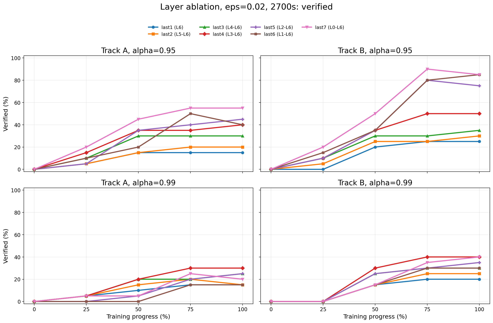
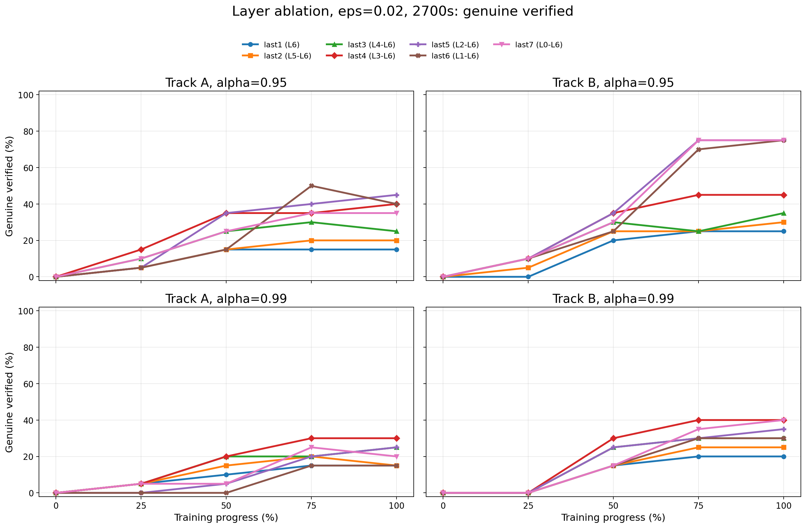
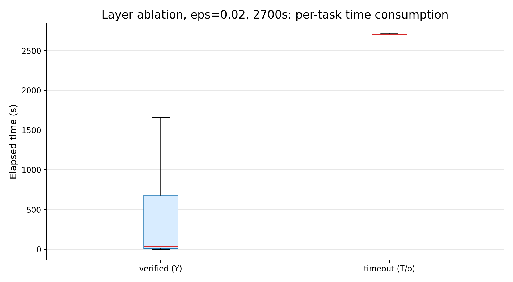

# Step 4 — Unary ON/OFF Layer Ablation

> High-timeout Marabou exact results

- **NAP family:** unary `ALWAYS_ON / ALWAYS_OFF`
- **Tracks:** A and B
- **Checkpoints per track:** 5 (`0%, 25%, 50%, 75%, 100%`)
- **Positive refs per checkpoint:** 20 fixed refs
- **Layer configs:** `last1` through `last7`
- **Runtime alpha:** `0.95`, `0.99`
- **Epsilon:** `0.02`
- **Solver encoding:** single disjunctive misclassification constraint per query
- **Timeout:** 2700s per query

Layer configs:

| Config | Layers used |
|--------|-------------|
| `last1` | `L6` only |
| `last2` | `L5-L6` |
| `last3` | `L4-L6` |
| `last4` | `L3-L6` |
| `last5` | `L2-L6` |
| `last6` | `L1-L6` |
| `last7` | `L0-L6`, all unary rules |

Data sources:

- `generated/step4_unary_ablation_ht_A/results/coverage.csv`
- `generated/step4_unary_ablation_ht_B/results/coverage.csv`
- `generated/step4_unary_ablation_ht_A/results/verify/*.json`
- `generated/step4_unary_ablation_ht_B/results/verify/*.json`
- `generated/step4_marabou_v2/results/coverage.csv` for the baseline reference only

The baseline row uses the existing per-target-class solver (`step4_marabou_v2`, up to 2700s total across targets). The NAP ablation rows use the 2700s single-disjunction high-timeout re-run.

---

## 1. How to Read the Tables

Each table cell is:

> `genuine / verified / timeout`

where:

- **genuine** means Marabou returned UNSAT and the proof is non-vacuous;
- **verified** counts all UNSAT proofs, including vacuous cases;
- **timeout** means Marabou did not return a final answer within 2700s.

The denominator is always 20 fixed refs for progress `25%` onward. An asterisk `*` marks one missing verification task. No adversarial SAT counterexamples were returned by the 2700s disjunctive NAP ablation runs.

---

## 2. Aggregated Final-Checkpoint Reading

Final checkpoint, `eps=0.02`, 2700s:

| Config | Track A, `alpha=0.95` | Track A, `alpha=0.99` | Track B, `alpha=0.95` | Track B, `alpha=0.99` |
|--------|----------------------:|----------------------:|----------------------:|----------------------:|
| baseline | 3/3/17 | — | 4/4/16 | — |
| `last1` | 3/3/17 | 3/3/17 | 5/5/15 | 4/4/16 |
| `last2` | 4/4/16 | 3/3/17 | 6/6/14 | 5/5/15 |
| `last3` | 5/6/14 | 5/5/15 | 7/7/13 | 6/6/14 |
| `last4` | 8/8/12 | 6/6/14 | 9/10/10 | 8/8/12 |
| `last5` | 9/9/11 | 5/5/15 | 15/15/5 | 7/7/13 |
| `last6` | 8/8/12 | 3/3/17 | 15/17/3 | 6/6/14 |
| `last7` | 7/11/9 | 4/4/16 | 15/17/3 | 8/8/12 |

Direct reading:

- At `eps=0.02`, using only the final layer is not enough. `last1` remains close to baseline, especially on Track A.
- Mid-to-late layer configs are stronger. Track A is best around `last4-last5`; Track B is strongest around `last5-last7`.
- `alpha=0.95` gives stronger verified/genuine rates than `alpha=0.99`, but it also introduces vacuity in the all-layer setting (`last7`: Track A `7/11/9`, Track B `15/17/3`).
- The high-timeout run resolves more cases than the 600s run, but the remaining unresolved mass is still timeout, not adversarial SAT.

---

## 3. Verified vs Genuine Over Training

The verified figure counts vacuous proofs as verified. The genuine figure removes those vacuous proofs.

The main difference appears at `alpha=0.95`: deeper configs can produce more total verified cases, but some of that gain is vacuous. This is why the genuine figure is the safer one for interpretation.

---

## 4. Exact Checkpoint Tables

### Track A, `alpha=0.95`

| Progress | `last1` | `last2` | `last3` | `last4` | `last5` | `last6` | `last7` |
|----------|--------:|--------:|--------:|--------:|--------:|--------:|--------:|
| 25% | 1/1/19 | 1/1/19 | 2/2/18 | 3/3/17 | 1/1/19 | 1/2/18 | 2/4/16 |
| 50% | 3/3/17 | 3/3/16* | 5/6/14 | 7/7/13 | 7/7/13 | 3/4/16 | 5/9/11 |
| 75% | 3/3/17 | 4/4/16 | 6/6/14 | 7/7/13 | 8/8/12 | 10/10/10 | 7/11/9 |
| 100% | 3/3/17 | 4/4/16 | 5/6/14 | 8/8/12 | 9/9/11 | 8/8/12 | 7/11/9 |

### Track A, `alpha=0.99`

| Progress | `last1` | `last2` | `last3` | `last4` | `last5` | `last6` | `last7` |
|----------|--------:|--------:|--------:|--------:|--------:|--------:|--------:|
| 25% | 1/1/19 | 1/1/19 | 1/1/19 | 1/1/19 | 0/0/20 | 0/0/20 | 1/1/19 |
| 50% | 2/2/18 | 3/3/17 | 4/4/16 | 4/4/16 | 1/1/19 | 0/0/20 | 1/1/19 |
| 75% | 3/3/17 | 4/4/16 | 4/4/16 | 6/6/14 | 4/4/16 | 3/3/17 | 5/5/15 |
| 100% | 3/3/17 | 3/3/17 | 5/5/15 | 6/6/14 | 5/5/15 | 3/3/17 | 4/4/16 |

### Track B, `alpha=0.95`

| Progress | `last1` | `last2` | `last3` | `last4` | `last5` | `last6` | `last7` |
|----------|--------:|--------:|--------:|--------:|--------:|--------:|--------:|
| 25% | 0/0/20 | 1/1/19 | 2/2/18 | 2/2/18 | 2/2/18 | 2/3/17 | 2/4/16 |
| 50% | 4/4/16 | 5/5/15 | 6/6/14 | 7/7/13 | 7/7/13 | 5/7/13 | 6/10/10 |
| 75% | 5/5/15 | 5/5/15 | 5/6/14 | 9/10/10 | 15/16/4 | 14/16/4 | 15/18/2 |
| 100% | 5/5/15 | 6/6/14 | 7/7/13 | 9/10/10 | 15/15/5 | 15/17/3 | 15/17/3 |

### Track B, `alpha=0.99`

| Progress | `last1` | `last2` | `last3` | `last4` | `last5` | `last6` | `last7` |
|----------|--------:|--------:|--------:|--------:|--------:|--------:|--------:|
| 25% | 0/0/20 | 0/0/20 | 0/0/20 | 0/0/20 | 0/0/20 | 0/0/20 | 0/0/20 |
| 50% | 3/3/17 | 3/3/17 | 5/5/15 | 6/6/14 | 5/5/15 | 3/3/17 | 3/3/17 |
| 75% | 4/4/16 | 5/5/15 | 6/6/14 | 8/8/12 | 6/6/14 | 6/6/14 | 7/7/13 |
| 100% | 4/4/16 | 5/5/15 | 6/6/14 | 8/8/12 | 7/7/13 | 6/6/14 | 8/8/12 |

---

## 5. Time Consumption

The 2700s high-timeout run has 2799 recorded verification-task JSONs: 1400 for Track B and 1399 for Track A. Track A has one missing task.

Excluding the 420 `misclassified` tasks at `epoch_000`:

| Result | n | median time | mean time | max time |
|--------|--:|------------:|----------:|---------:|
| verified (`Y`) | 556 | 36.50s | 501.71s | 2702.62s |
| timeout (`T/o`) | 1823 | 2703.54s | 2710.14s | 3188.66s |

By layer config:

| Config | n | verified | timeout | median time | mean time |
|--------|--:|---------:|--------:|------------:|----------:|
| `last1` | 340 | 44 | 296 | 2704.47s | 2384.63s |
| `last2` | 339 | 53 | 286 | 2704.01s | 2328.43s |
| `last3` | 340 | 72 | 268 | 2702.95s | 2214.00s |
| `last4` | 340 | 93 | 247 | 2701.55s | 2076.46s |
| `last5` | 340 | 93 | 247 | 2701.90s | 2110.49s |
| `last6` | 340 | 88 | 252 | 2701.62s | 2222.23s |
| `last7` | 340 | 113 | 227 | 2701.05s | 2022.22s |

Reading:

- Timeout cases run to the budget: median around 2703s.
- Verified cases are often much faster, but some verified proofs also finish close to the timeout.
- More layers reduce timeout count overall. This does not automatically mean the specification is better, because `alpha=0.95` can introduce vacuous proofs.

---

## 6. Appendix: `epoch_000`

The fixed refs were selected from trained checkpoints. At `epoch_000`, the random-init model misclassifies 15/20 refs in both tracks, so only 5 refs are eligible for verification. Under the 2700s high-timeout run at `eps=0.02`, all eligible `epoch_000` cases timeout:

| Track | Alpha | `last1` | `last2` | `last3` | `last4` | `last5` | `last6` | `last7` |
|-------|------:|--------:|--------:|--------:|--------:|--------:|--------:|--------:|
| A | 0.95 | 0/0/5/15 | 0/0/5/15 | 0/0/5/15 | 0/0/5/15 | 0/0/5/15 | 0/0/5/15 | 0/0/5/15 |
| A | 0.99 | 0/0/5/15 | 0/0/5/15 | 0/0/5/15 | 0/0/5/15 | 0/0/5/15 | 0/0/5/15 | 0/0/5/15 |
| B | 0.95 | 0/0/5/15 | 0/0/5/15 | 0/0/5/15 | 0/0/5/15 | 0/0/5/15 | 0/0/5/15 | 0/0/5/15 |
| B | 0.99 | 0/0/5/15 | 0/0/5/15 | 0/0/5/15 | 0/0/5/15 | 0/0/5/15 | 0/0/5/15 | 0/0/5/15 |

Here the cell format is `genuine / verified / timeout / misclassified`.

---

## 7. Summary

1. The 2700s high-timeout run shows that `eps=0.02` remains solver-hard, but NAP constraints do help.
2. The final layer alone is not enough at this radius; useful gains come from adding mid-to-late layers.
3. Track B benefits most clearly from deeper configs: `last5-last7` reach 15 genuine verified refs at `alpha=0.95`.
4. `alpha=0.95` is stronger but can be vacuous, especially for all-layer `last7`.
5. No adversarial SAT examples were found by the 2700s disjunctive NAP ablation runs; unresolved cases are still timeouts.
