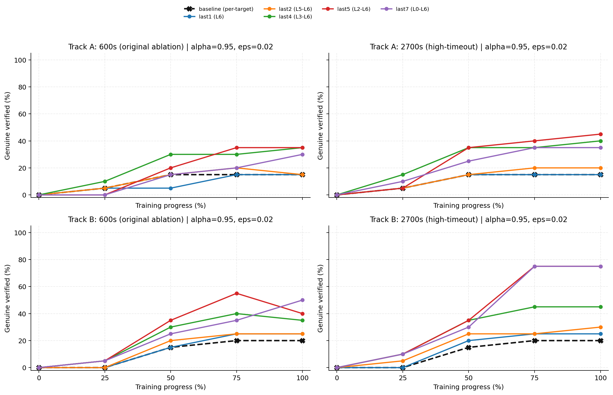
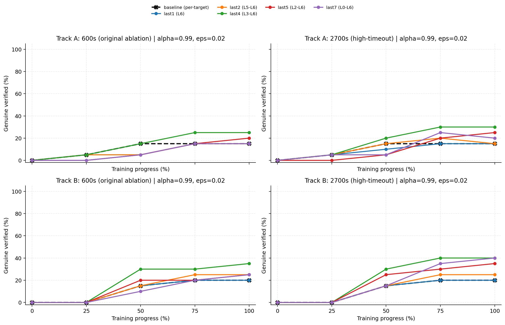
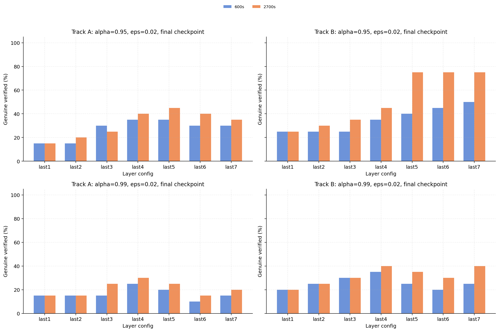
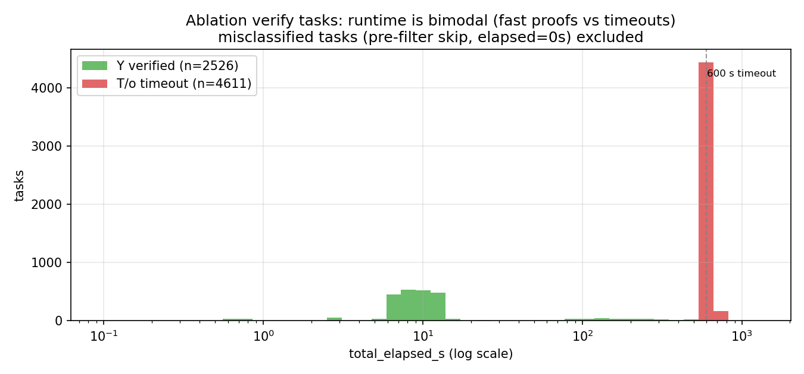
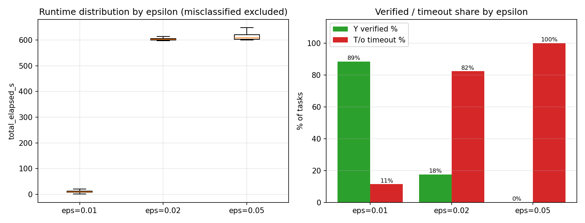
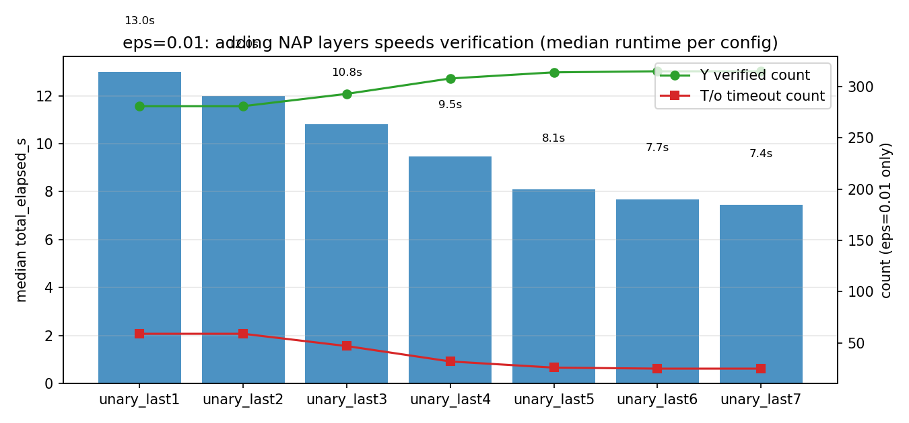

# Step 4 — Unary ON/OFF Layer Ablation

> Preview update for the `Random_to_welltrained` reports
> Marabou exact results only

- **NAP family:** unary `ALWAYS_ON / ALWAYS_OFF`
- **Tracks:** A and B
- **Checkpoints per track:** 5 (`0%, 25%, 50%, 75%, 100%`)
- **Positive refs per checkpoint:** 20 fixed refs (selected from checkpoints with progress >= 25%; see below)
- **Layer configs:** `baseline` (no NAP), `last1` through `last7`
- **Runtime alpha:** `0.95`, `0.99` (not applicable to baseline)
- **Epsilon:** `0.01`, `0.02`, `0.05`
- **Solver encoding (ablation):** single disjunctive misclassification constraint per query, 600s timeout
- **Solver encoding (baseline):** per-target-class solving, 300s per target, up to 2700s total (from `step4_marabou_v2`)

Layer configs:

| Config | Layers used |
|--------|-------------|
| `last1` | `L6` only |
| `last2` | `L5-L6` |
| `last3` | `L4-L6` |
| `last4` | `L3-L6` |
| `last5` | `L2-L6` |
| `last6` | `L1-L6` |
| `last7` | `L0-L6`, all unary rules |

Data sources:

- `generated/step4_unary_ablation_full_A/results/coverage.csv` (layer ablation)
- `generated/step4_unary_ablation_full_B/results/coverage.csv` (layer ablation)
- `generated/step4_marabou_v2/results/coverage.csv` (baseline, same fixed refs)

Track A has 3 missing verify tasks out of 4200. They are all at `eps=0.02`, progress `50%`, and do not affect the `eps=0.01` conclusions.

### Reference selection

The 20 fixed refs per track are selected by `step4_unified_refs.py`:

1. Exclude `epoch_000` (random init, progress < 25%) from the intersection.
2. Take MNIST test samples that are correctly classified by **all** remaining checkpoints (25%, 50%, 75%, 100%).
3. Rank by dataset index and select the first 20.

Because `epoch_000` is not part of the intersection, the random-init checkpoint misclassifies 15/20 refs in both tracks. Only 5 refs are eligible for verification at `epoch_000`. For all checkpoints with progress >= 25%, misclassified = 0 and all 20 refs are eligible.

**The main tables below show only progress >= 25%.** The `epoch_000` row is included in a separate appendix for completeness.

### Solver encoding note

This ablation uses a **single disjunctive constraint** encoding (all 9 target classes in one query, 600s total timeout). The earlier `step4_marabou.py` used **per-target-class solving** (up to 9 separate queries, 300s each, up to 2700s total). This means some cases that were resolved as adversarial in the old solver may appear as timeout here. A high-timeout re-run (`deploy_ablation_hightimeout.sh`, 2700s) is in progress to confirm.

---

## 1. How to Read the Tables

Each table cell is:

> `genuine / verified / timeout`

where:

- **genuine**: verified AND non-vacuous (the strongest result);
- **verified**: Marabou returned UNSAT for the adversarial query, including vacuous cases;
- **timeout**: Marabou did not return a final answer within 600s.

The denominator is always 20 fixed refs. An asterisk `*` marks a row with one missing verification task. When adversarial counterexamples are found, `N=<count>` is appended to the cell.

For baseline (no NAP constraints), genuine = verified always (no vacuity possible). Baseline data comes from `step4_marabou_v2` which uses per-target encoding (up to 2700s).

**No adversarial counterexamples (SAT) were returned** in the layer-ablation configs under the 600s disjunctive encoding. All non-verified eligible cases are timeouts. However, the baseline (per-target solver, up to 2700s) found adversarial cases at `eps=0.02` and `eps=0.05`. Therefore, "no SAT returned" in ablation configs should not be read as "no adversarial examples exist"; it reflects the solver timeout limit.

---

## 2. Aggregated Final-Checkpoint Reading

### `eps=0.01`

| Config | Track A, `alpha=0.95` | Track A, `alpha=0.99` | Track B, `alpha=0.95` | Track B, `alpha=0.99` |
|--------|----------------------:|----------------------:|----------------------:|----------------------:|
| baseline | 17/17/3 | — | 18/18/2 | — |
| `last1` | 17/18/2 | 18/18/2 | 20/20/0 | 20/20/0 |
| `last4` | 18/19/1 | 19/19/1 | 19/20/0 | 20/20/0 |
| `last7` | 9/19/1 | 19/19/1 | 10/20/0 | 20/20/0 |

### Direct reading

- Baseline (no NAP) at the final checkpoint verifies `17/20` (Track A) and `18/20` (Track B). Adding even `last1` NAP at `alpha=0.99` matches or exceeds this.
- At `alpha=0.99`, `last1` is already close to `last7`: final genuine is `18/20` vs `19/20` on Track A, and `20/20` vs `20/20` on Track B.
- At `alpha=0.95`, full-network `last7` is misleading if vacuous cases are counted: Track A is `9/19/1`, Track B is `10/20/0`.
- The clean small-radius setting is therefore not simply "use more layers"; it is closer to "use high-confidence deep rules."

### `eps=0.02`

| Config | Track A, `alpha=0.95` | Track A, `alpha=0.99` | Track B, `alpha=0.95` | Track B, `alpha=0.99` |
|--------|----------------------:|----------------------:|----------------------:|----------------------:|
| baseline | 3/3/17 | — | 4/4/16 | — |
| `last1` | 3/3/17 | 3/3/17 | 5/5/15 | 4/4/16 |
| `last2` | 3/3/17 | 3/3/17 | 5/5/15 | 5/5/15 |
| `last4` | 7/7/13 | 5/5/15 | 7/8/12 | 7/7/13 |
| `last7` | 6/10/10 | 3/3/17 | 10/12/8 | 5/5/15 |

### Direct reading

- Baseline at `eps=0.02` final: `3/3/17` (A) and `4/4/16` (B). Most NAP configs match or exceed this.
- `eps=0.02` is much harder than `eps=0.01`.
- `last1` and `last2` do not fail because Marabou finds adversarial examples. They fail by timeout under this solver configuration.
- Mid-to-late layer sets, especially `last4`, can help at `eps=0.02`.
- The result is less clean than `eps=0.01`; it does not support a universal "last layer only" rule.
- Note: the baseline per-target solver found adversarial at `eps=0.02` (A 75%: N=2, B 50%: N=1) but these do not appear in the final checkpoint row.

---

## 3. `eps=0.01`: Verified vs Genuine (progress >= 25%)

### Exact checkpoint tables

#### Track A

| Progress | baseline | `last1` (0.95) | `last1` (0.99) | `last4` (0.95) | `last4` (0.99) | `last7` (0.95) | `last7` (0.99) |
|----------|--------:|--------:|--------:|--------:|--------:|--------:|--------:|
| 25% | 15/15/5 | 18/18/2 | 15/15/5 | 16/19/1 | 15/15/5 | 10/19/1 | 15/16/4 |
| 50% | 15/15/5 | 17/17/3 | 15/15/5 | 18/19/1 | 16/16/4 | 12/19/1 | 16/17/3 |
| 75% | 17/17/3 | 17/18/2 | 18/18/2 | 18/19/1 | 18/18/2 | 8/19/1 | 19/19/1 |
| 100% | 17/17/3 | 17/18/2 | 18/18/2 | 18/19/1 | 19/19/1 | 9/19/1 | 19/19/1 |

Full Track A tables (all layer configs)

**Track A, `alpha=0.95`**

| Progress | baseline | `last1` | `last2` | `last3` | `last4` | `last5` | `last6` | `last7` |
|----------|--------:|--------:|--------:|--------:|--------:|--------:|--------:|--------:|
| 25% | 15/15/5 | 18/18/2 | 15/16/4 | 16/19/1 | 16/19/1 | 16/19/1 | 11/19/1 | 10/19/1 |
| 50% | 15/15/5 | 17/17/3 | 16/17/3 | 18/19/1 | 18/19/1 | 17/19/1 | 13/19/1 | 12/19/1 |
| 75% | 17/17/3 | 17/18/2 | 17/18/2 | 18/19/1 | 18/19/1 | 17/20/0 | 13/19/1 | 8/19/1 |
| 100% | 17/17/3 | 17/18/2 | 17/18/2 | 18/19/1 | 18/19/1 | 17/19/1 | 14/19/1 | 9/19/1 |

**Track A, `alpha=0.99`**

| Progress | baseline | `last1` | `last2` | `last3` | `last4` | `last5` | `last6` | `last7` |
|----------|--------:|--------:|--------:|--------:|--------:|--------:|--------:|--------:|
| 25% | 15/15/5 | 15/15/5 | 15/15/5 | 15/15/5 | 15/15/5 | 15/15/5 | 15/16/4 | 15/16/4 |
| 50% | 15/15/5 | 15/15/5 | 16/16/4 | 17/17/3 | 16/16/4 | 16/16/4 | 17/17/3 | 16/17/3 |
| 75% | 17/17/3 | 18/18/2 | 18/18/2 | 18/18/2 | 18/18/2 | 19/19/1 | 19/19/1 | 19/19/1 |
| 100% | 17/17/3 | 18/18/2 | 18/18/2 | 18/18/2 | 19/19/1 | 19/19/1 | 19/19/1 | 19/19/1 |

#### Track B

| Progress | baseline | `last1` (0.95) | `last1` (0.99) | `last4` (0.95) | `last4` (0.99) | `last7` (0.95) | `last7` (0.99) |
|----------|--------:|--------:|--------:|--------:|--------:|--------:|--------:|
| 25% | 14/14/6 | 15/16/4 | 13/14/6 | 14/17/3 | 14/14/6 | 11/18/2 | 13/14/6 |
| 50% | 16/16/4 | 16/17/3 | 17/17/3 | 17/18/2 | 18/18/2 | 9/19/1 | 17/17/3 |
| 75% | 18/18/2 | 20/20/0 | 20/20/0 | 19/20/0 | 20/20/0 | 10/20/0 | 20/20/0 |
| 100% | 18/18/2 | 20/20/0 | 20/20/0 | 19/20/0 | 20/20/0 | 10/20/0 | 20/20/0 |

Full Track B tables (all layer configs)

**Track B, `alpha=0.95`**

| Progress | baseline | `last1` | `last2` | `last3` | `last4` | `last5` | `last6` | `last7` |
|----------|--------:|--------:|--------:|--------:|--------:|--------:|--------:|--------:|
| 25% | 14/14/6 | 15/16/4 | 15/16/4 | 15/16/4 | 14/17/3 | 14/18/2 | 12/18/2 | 11/18/2 |
| 50% | 16/16/4 | 16/17/3 | 17/18/2 | 17/18/2 | 17/18/2 | 16/19/1 | 14/19/1 | 9/19/1 |
| 75% | 18/18/2 | 20/20/0 | 19/20/0 | 19/20/0 | 19/20/0 | 18/20/0 | 12/20/0 | 10/20/0 |
| 100% | 18/18/2 | 20/20/0 | 19/20/0 | 19/20/0 | 19/20/0 | 18/20/0 | 12/20/0 | 10/20/0 |

**Track B, `alpha=0.99`**

| Progress | baseline | `last1` | `last2` | `last3` | `last4` | `last5` | `last6` | `last7` |
|----------|--------:|--------:|--------:|--------:|--------:|--------:|--------:|--------:|
| 25% | 14/14/6 | 13/14/6 | 14/14/6 | 14/14/6 | 14/14/6 | 14/14/6 | 14/14/6 | 13/14/6 |
| 50% | 16/16/4 | 17/17/3 | 17/17/3 | 18/18/2 | 18/18/2 | 17/17/3 | 17/17/3 | 17/17/3 |
| 75% | 18/18/2 | 20/20/0 | 20/20/0 | 20/20/0 | 20/20/0 | 20/20/0 | 20/20/0 | 20/20/0 |
| 100% | 18/18/2 | 20/20/0 | 20/20/0 | 20/20/0 | 20/20/0 | 20/20/0 | 20/20/0 | 20/20/0 |

### Direct reading

- Baseline at final: `17/17/3` (A) and `18/18/2` (B). No vacuity by definition.
- At `alpha=0.99`, even `last1` matches or exceeds baseline genuine rate.
- At `alpha=0.95`, adding more layers inflates verified through vacuity: Track A final `last7` is `9/19/1` (genuine 9 < baseline 17).
- At `alpha=0.99`, vacuity is much smaller, so `genuine` and `verified` are nearly identical across all configs.

---

## 4. `eps=0.02`: Verified vs Genuine (progress >= 25%)

### Exact checkpoint tables

#### Track A

| Progress | baseline | `last1` (0.95) | `last1` (0.99) | `last4` (0.95) | `last4` (0.99) | `last7` (0.95) | `last7` (0.99) |
|----------|--------:|--------:|--------:|--------:|--------:|--------:|--------:|
| 25% | 1/1/19 | 1/1/19 | 1/1/19 | 2/2/18 | 1/1/19 | 0/2/18 | 0/0/20 |
| 50% | 3/3/17 | 1/1/18* | 1/1/19 | 6/6/14 | 3/3/17 | 3/7/13 | 1/1/18* |
| 75% | 3/3/15, N=2 | 3/3/17 | 3/3/17 | 6/6/14 | 5/5/15 | 4/8/12 | 3/3/17 |
| 100% | 3/3/17 | 3/3/17 | 3/3/17 | 7/7/13 | 5/5/15 | 6/10/10 | 3/3/17 |

Full Track A tables (all layer configs)

**Track A, `alpha=0.95`**

| Progress | baseline | `last1` | `last2` | `last3` | `last4` | `last5` | `last6` | `last7` |
|----------|--------:|--------:|--------:|--------:|--------:|--------:|--------:|--------:|
| 25% | 1/1/19 | 1/1/19 | 1/1/19 | 1/1/19 | 2/2/18 | 0/0/20 | 1/1/19 | 0/2/18 |
| 50% | 3/3/17 | 1/1/18* | 3/3/16* | 4/5/15 | 6/6/14 | 4/4/16 | 2/3/17 | 3/7/13 |
| 75% | 3/3/15, N=2 | 3/3/17 | 4/4/16 | 6/6/14 | 6/6/14 | 7/7/13 | 4/4/16 | 4/8/12 |
| 100% | 3/3/17 | 3/3/17 | 3/3/17 | 6/6/14 | 7/7/13 | 7/7/13 | 6/6/14 | 6/10/10 |

**Track A, `alpha=0.99`**

| Progress | baseline | `last1` | `last2` | `last3` | `last4` | `last5` | `last6` | `last7` |
|----------|--------:|--------:|--------:|--------:|--------:|--------:|--------:|--------:|
| 25% | 1/1/19 | 1/1/19 | 1/1/19 | 1/1/19 | 1/1/19 | 0/0/20 | 0/0/20 | 0/0/20 |
| 50% | 3/3/17 | 1/1/19 | 1/1/19 | 1/1/19 | 3/3/17 | 1/1/19 | 0/0/20 | 1/1/18* |
| 75% | 3/3/15, N=2 | 3/3/17 | 3/3/17 | 3/3/17 | 5/5/15 | 3/3/17 | 3/3/17 | 3/3/17 |
| 100% | 3/3/17 | 3/3/17 | 3/3/17 | 3/3/17 | 5/5/15 | 4/4/16 | 2/2/18 | 3/3/17 |

#### Track B

| Progress | baseline | `last1` (0.95) | `last1` (0.99) | `last4` (0.95) | `last4` (0.99) | `last7` (0.95) | `last7` (0.99) |
|----------|--------:|--------:|--------:|--------:|--------:|--------:|--------:|
| 25% | 0/0/20 | 0/0/20 | 0/0/20 | 1/1/19 | 0/0/20 | 1/3/17 | 0/0/20 |
| 50% | 3/3/16, N=1 | 3/3/17 | 3/3/17 | 6/6/14 | 6/6/14 | 5/9/11 | 2/2/18 |
| 75% | 4/4/16 | 5/5/15 | 4/4/16 | 8/9/11 | 6/6/14 | 7/9/11 | 4/4/16 |
| 100% | 4/4/16 | 5/5/15 | 4/4/16 | 7/8/12 | 7/7/13 | 10/12/8 | 5/5/15 |

Full Track B tables (all layer configs)

**Track B, `alpha=0.95`**

| Progress | baseline | `last1` | `last2` | `last3` | `last4` | `last5` | `last6` | `last7` |
|----------|--------:|--------:|--------:|--------:|--------:|--------:|--------:|--------:|
| 25% | 0/0/20 | 0/0/20 | 0/0/20 | 0/0/20 | 1/1/19 | 1/1/19 | 0/1/19 | 1/3/17 |
| 50% | 3/3/16, N=1 | 3/3/17 | 4/4/16 | 6/6/14 | 6/6/14 | 7/7/13 | 2/4/16 | 5/9/11 |
| 75% | 4/4/16 | 5/5/15 | 5/5/15 | 5/6/14 | 8/9/11 | 11/12/8 | 8/10/10 | 7/9/11 |
| 100% | 4/4/16 | 5/5/15 | 5/5/15 | 5/5/15 | 7/8/12 | 8/8/12 | 9/11/9 | 10/12/8 |

**Track B, `alpha=0.99`**

| Progress | baseline | `last1` | `last2` | `last3` | `last4` | `last5` | `last6` | `last7` |
|----------|--------:|--------:|--------:|--------:|--------:|--------:|--------:|--------:|
| 25% | 0/0/20 | 0/0/20 | 0/0/20 | 0/0/20 | 0/0/20 | 0/0/20 | 0/0/20 | 0/0/20 |
| 50% | 3/3/16, N=1 | 3/3/17 | 3/3/17 | 4/4/16 | 6/6/14 | 4/4/16 | 1/1/19 | 2/2/18 |
| 75% | 4/4/16 | 4/4/16 | 5/5/15 | 6/6/14 | 6/6/14 | 4/4/16 | 1/1/19 | 4/4/16 |
| 100% | 4/4/16 | 4/4/16 | 5/5/15 | 6/6/14 | 7/7/13 | 5/5/15 | 4/4/16 | 5/5/15 |

### Direct reading

- Baseline at `eps=0.02` found adversarial counterexamples at intermediate checkpoints (A 75%: N=2, B 50%: N=1). These are real SAT results from the per-target solver (2700s budget).
- The ablation configs (600s disjunctive) found zero adversarial; all non-verified cases are timeouts. A high-timeout re-run (2700s) is pending to determine whether these timeouts hide adversarial cases.
- Track A final `last1/last2` are only `3/3/17` for both alphas, matching baseline.
- Track B final `last1/last2` are stronger, but still only `4-5` genuine out of 20.
- The best final rows are from deeper subsets:
  - Track A: `last4` or `last5`, up to `7/7/13` at `alpha=0.95`;
  - Track B: `last7` reaches `10/12/8` at `alpha=0.95`, while `last4` reaches `7/7/13` at `alpha=0.99`.

---

## 5. `eps=0.05`

At `eps=0.05`, both genuine and verified are always zero across all checkpoints (progress >= 25%), both alphas, and all layer configs (including baseline).

All non-verified cases are timeouts, except baseline at B 75% which found 2 adversarial (N=2). The current Marabou setup cannot resolve useful certificates at this radius.

---

## 6. Solver Encoding Comparison

Three solver configurations are used in this report on the same 20 fixed refs:

| Aspect | Ablation 600s | Ablation 2700s (ht) | Baseline (`step4_marabou_v2`) |
|--------|:-------------:|:-------------------:|:-----------------------------:|
| Encoding | Single disjunction (all 9 targets) | Single disjunction (all 9 targets) | Per-target-class (up to 9 separate queries) |
| Timeout | 600s per query | 2700s per query | 300s per target (≤ 2700s total) |
| Adversarial found (eps=0.02) | 0 | 0 | 3 (baseline only) |
| Data source | `step4_unary_ablation_full_{A,B}` | `step4_unary_ablation_ht_{A,B}` | `step4_marabou_v2` |

The 3 baseline adversarial cases at `eps=0.02` required > 600s per target. The disjunctive encoding with 2700s still found zero adversarial. This is a structural difference between the two encodings: per-target-class solving is more efficient at finding SAT witnesses (adversarial examples), while the disjunctive encoding is harder for Marabou to falsify. Increasing the budget for the disjunctive encoding resolves more timeouts into UNSAT (verified), but does not recover adversarial SAT witnesses.

---

## 7. High-Timeout Re-Run Results (`eps=0.02`, 2700s disjunctive)

A high-timeout re-run (`deploy_ablation_hightimeout.sh`, 2700s) was completed for `eps=0.02` only, covering the same 7 layer configs × 2 alphas × 2 tracks × 5 checkpoints (700 jobs total).

**Key findings:**

- **Zero adversarial examples** were found even at 2700s disjunctive encoding.
- Many 600s timeouts were resolved: the longer budget converts timeouts into verified (UNSAT) for many instances.
- The remaining timeouts at 2700s represent genuinely hard queries — not confirmed adversarial.

### Final checkpoint comparison (`eps=0.02`, genuine verified / verified / timeout)

| Config | Track A α=0.95 600s→2700s | Track A α=0.99 600s→2700s | Track B α=0.95 600s→2700s | Track B α=0.99 600s→2700s |
|--------|:-------------------------:|:-------------------------:|:-------------------------:|:-------------------------:|
| `last1` | 3/3/17 → 3/3/17 | 3/3/17 → 3/3/17 | 5/5/15 → 5/5/15 | 4/4/16 → 4/4/16 |
| `last2` | 3/3/17 → 4/4/16 | 3/3/17 → 3/3/17 | 5/5/15 → 6/6/14 | 5/5/15 → 5/5/15 |
| `last4` | 7/7/13 → 8/8/12 | 5/5/15 → 6/6/14 | 7/8/12 → 9/10/10 | 7/7/13 → 8/8/12 |
| `last5` | 7/7/13 → 9/9/11 | 4/4/16 → 5/5/15 | 8/8/12 → **15/15/5** | 5/5/15 → 7/7/13 |
| `last7` | 6/10/10 → 7/11/9 | 3/3/17 → 4/4/16 | 10/12/8 → **15/17/3** | 5/5/15 → 8/8/12 |

### Figures

### Direct reading

- `last1` and `last2` show little or no improvement: they were timeout-dominated at 600s and remain so at 2700s for the cases that did not resolve.
- Track B benefits strongly from deeper configs at 2700s: `last5` jumps from 8/8/12 to 15/15/5, and `last7` from 10/12/8 to 15/17/3. This is the clearest evidence that at `eps=0.02`, deeper NAP constraints verifiably exclude most adversarial inputs given sufficient solver time.
- Track A shows smaller improvements (600s was already close to saturation for shallow configs; deeper configs gain 1-2 at final).
- At `alpha=0.99`, improvements are smaller but consistent: `last4` gains 1 on both tracks, deeper configs gain 1-3.
- The zero adversarial count at 2700s confirms that the disjunctive encoding is not finding SAT witnesses at this time budget. The baseline adversarial cases at `eps=0.02` were found by per-target-class solving.

---

## 8. Appendix: `epoch_000` (random init)

At `epoch_000`, 15/20 fixed refs are misclassified by the random-init model (the refs were selected from trained checkpoints). Only 5 refs are eligible for positive-ref verification.

Among those 5 eligible refs at `eps=0.01`:

| Config range | Track A, `alpha=0.95` | Track A, `alpha=0.99` | Track B, `alpha=0.95` | Track B, `alpha=0.99` |
|-------------|----------------------:|----------------------:|----------------------:|----------------------:|
| `last1-last2` | 0/0/5 | 0/0/5 | 0/0/5 | 0/0/5 |
| `last3` | 1/1/4 | 1/1/4 | 1/1/4 | 0/0/5 |
| `last4` | 5/5/0 | 4/4/1 | 5/5/0 | 3/3/2 |
| `last5-last7` | 3-5/5/0 | 5/5/0 | 3-5/5/0 | 5/5/0 |

At `eps=0.02` and `eps=0.05`, all 5 eligible refs timeout across all configs at `epoch_000`.

---

## 9. Data-First Summary

1. For `eps=0.01`, `alpha=0.99`, using only the final layer already exceeds baseline: `last1` reaches `18/18/2` on Track A final and `20/20/0` on Track B final, vs baseline `17/17/3` and `18/18/2`.
2. For `eps=0.01`, `alpha=0.95`, all-layer `last7` is misleading if vacuous cases are counted: Track A final is `9/19/1`, Track B final is `10/20/0`. The genuine rate is **worse** than baseline.
3. For `eps=0.02`, the 600s disjunctive encoding is timeout-limited. Mid-to-late configs can help: `last4` and `last5` exceed baseline genuine rate even at 600s.
4. For `eps=0.02`, the 2700s high-timeout re-run confirms that deeper layer configs make genuine progress with more solver time — particularly on Track B where `last5` reaches 75% genuine and `last7` reaches 75% genuine at the final checkpoint. No adversarial examples were found under the disjunctive encoding at either timeout.
5. For `eps=0.02`, the zero adversarial count under disjunctive encoding (even at 2700s) does **not** mean adversarial examples do not exist. The baseline per-target solver found 3 adversarial cases at `eps=0.02`. The disjunctive encoding is structurally less effective at finding SAT witnesses.
6. For `eps=0.05`, no config (including baseline) gives useful verified or genuine mass.

The safest final statement is:

> In trained networks, most of the small-radius unary ON/OFF signal is already present in the final layers. At `alpha=0.99`, even `last1` exceeds the baseline genuine rate. Full-network unary rules can inflate total verified rates through vacuity, especially at `alpha=0.95`, where genuine can drop below baseline. At larger radius (`eps=0.02`), the disjunctive encoding is solver-time-limited: the 2700s high-timeout re-run recovers many verified cases (especially deep configs on Track B) but finds no adversarial examples. This is a property of the solver encoding, not of the absence of adversarial inputs.

---

## 10. Runtime Profile of the Ablation Tasks

Each ablation verify task records `total_elapsed_s` in its result JSON. Aggregating over all 8397 tasks (Track A and Track B combined) gives a clear runtime picture that complements the genuine/verified/timeout counts above.

Data source:

- per-task JSONs under `generated/step4_unary_ablation_full_A/results/verify/` and `generated/step4_unary_ablation_full_B/results/verify/`
- exported for local analysis as `update_overview/ablation_task_runtime.csv` by `update_overview/export_ablation_task_runtime.py`; the per-task JSONs are the authoritative source

### 10.1 Runtime is Bimodal

Excluding the 1260 `misclassified` tasks (which are skipped before verification and record `total_elapsed_s=0`):

| Result | n | median | mean | max |
| --- | ---: | ---: | ---: | ---: |
| `Y` verified | 2526 | 9.54 s | 34.26 s | 598.99 s |
| `T/o` timeout | 4611 | 604.78 s | 613.08 s | 927.75 s |

The distribution is sharply bimodal. Verified proofs are usually finished well below 30 s, while unresolved cases almost always run to the 600 s timeout. The `max` of 927.75 s for timeouts reflects solver-cleanup and rule-loading overhead that is not cut by the 600 s limit.

This means "slow" cases are **not** slow because the proof is long; they are slow because the solver ran out of time.

### 10.2 Epsilon is the Dominant Factor

Counts (misclassified excluded):

| Epsilon | n | Y verified | T/o timeout | Y % | Timeout % |
| ---: | ---: | ---: | ---: | ---: | ---: |
| 0.01 | 2380 | 2107 | 273 | 88.5% | 11.5% |
| 0.02 | 2377 | 419 | 1958 | 17.6% | 82.4% |
| 0.05 | 2380 | 0 | 2380 | 0.0% | 100.0% |

The transition is not gradual. Between `eps=0.01` and `eps=0.02`, timeout rate jumps from `11.5%` to `82.4%`. At `eps=0.05`, every non-skipped task hits the timeout.

This means the `eps=0.05` row in the genuine/verified tables is not "NAP does not help"; it is "the solver cannot decide under the current encoding". It is a solver-capacity observation, not a specification-quality observation.

### 10.3 Adding Layers Speeds Verification

At `eps=0.01`, with both alpha settings combined (misclassified excluded):

| Config | n | median | mean | Y | T/o |
| --- | ---: | ---: | ---: | ---: | ---: |
| `last1` | 340 | 12.99 s | 138.30 s | 281 | 59 |
| `last2` | 340 | 11.99 s | 126.49 s | 281 | 59 |
| `last3` | 340 | 10.81 s | 107.99 s | 293 | 47 |
| `last4` | 340 | 9.47 s | 77.47 s | 308 | 32 |
| `last5` | 340 | 8.09 s | 65.74 s | 314 | 26 |
| `last6` | 340 | 7.69 s | 62.68 s | 315 | 25 |
| `last7` | 340 | 7.44 s | 60.28 s | 315 | 25 |

Adding NAP layers reduces median runtime monotonically and also reduces timeout count. The standard reading is that more unary constraints shrink the feasible region, which helps the solver prove UNSAT faster. This must be read together with vacuity: a smaller feasible region that excludes the reference point itself is not a useful speedup, which is why `alpha=0.95, last7` is fast but produces vacuous cases.

### 10.4 Alpha Has a Smaller but Consistent Effect

Counts across all eps (misclassified excluded):

| Epsilon | Alpha | n | median | Y | T/o | Timeout rate |
| ---: | ---: | ---: | ---: | ---: | ---: | ---: |
| 0.01 | 0.95 | 1190 | 9.04 s | 1090 | 100 | 8.4% |
| 0.01 | 0.99 | 1190 | 10.46 s | 1017 | 173 | 14.5% |
| 0.02 | 0.95 | 1188 | 601.87 s | 272 | 916 | 77.1% |
| 0.02 | 0.99 | 1189 | 602.68 s | 147 | 1042 | 87.6% |
| 0.05 | 0.95 | 1190 | 606.42 s | 0 | 1190 | 100.0% |
| 0.05 | 0.99 | 1190 | 610.32 s | 0 | 1190 | 100.0% |

`alpha=0.95` is slightly faster and has a lower timeout rate at `eps=0.01` and `eps=0.02`, for the same reason as more layers: the resulting NAP region is tighter, so UNSAT is easier to prove. This is **not** the same as saying `alpha=0.95` is better as a specification — Sections 3-8 show it also causes more vacuous cases.

### 10.5 One-line Reading

> Ablation runtime is dominated by `eps`, not by layer config or alpha. At `eps=0.01` most proofs finish in under ~10 s and timeouts are rare; at `eps=0.02` most tasks hit the timeout; at `eps=0.05` every non-skipped task times out. Within a given `eps`, adding layers and lowering alpha shrink the feasible region and speed up proofs, but this speedup must be read together with vacuity, not as a standalone improvement.
