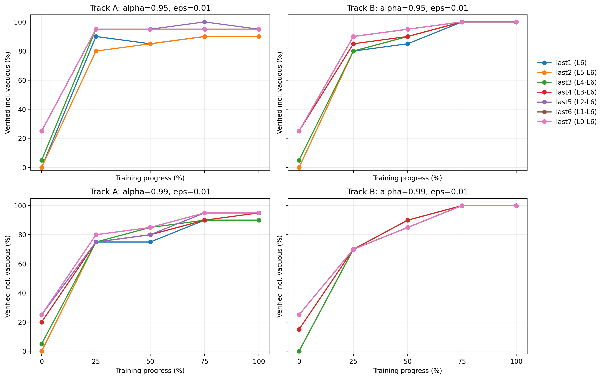
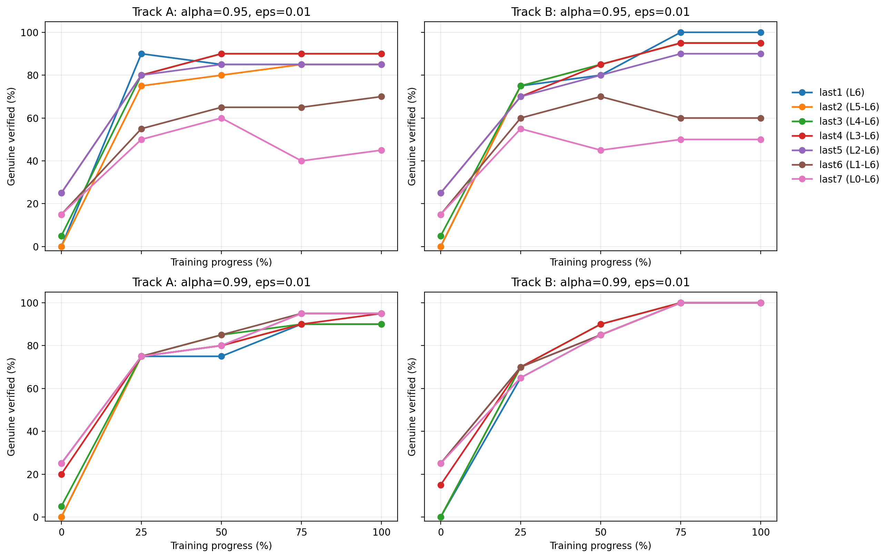
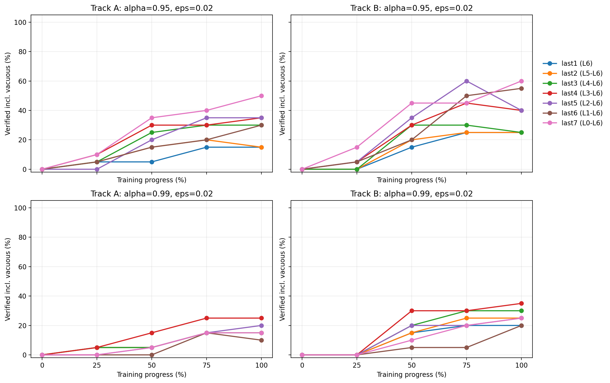
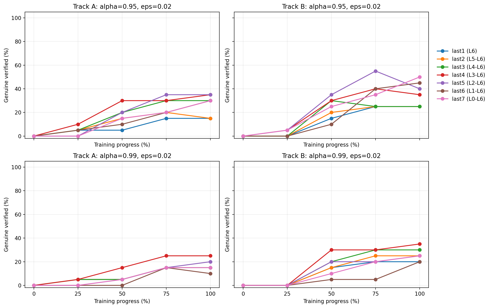

# Step 4 — Unary ON/OFF Layer Ablation

> Preview update for the `Random_to_welltrained` reports
> Marabou exact results only

- **NAP family:** unary `ALWAYS_ON / ALWAYS_OFF`
- **Tracks:** A and B
- **Checkpoints per track:** 5 (`0%, 25%, 50%, 75%, 100%`)
- **Positive refs per checkpoint:** 20 fixed refs
- **Layer configs:** `last1` through `last7`
- **Runtime alpha:** `0.95`, `0.99`
- **Epsilon:** `0.01`, `0.02`, `0.05`

Layer configs:

| Config | Layers used |
|--------|-------------|
| `last1` | `L6` only |
| `last2` | `L5-L6` |
| `last3` | `L4-L6` |
| `last4` | `L3-L6` |
| `last5` | `L2-L6` |
| `last6` | `L1-L6` |
| `last7` | `L0-L6`, all unary rules |

Data sources:

- `generated/step4_unary_ablation_full_A/results/coverage.csv`
- `generated/step4_unary_ablation_full_B/results/coverage.csv`

Track A has 3 missing verify tasks out of 4200. They are all at `eps=0.02`, progress `50%`, and do not affect the `eps=0.01` conclusions.

---

## 1. How to Read the Tables and Figures

Each table cell is:

> `genuine / verified / timeout / misclassified`

where:

- `genuine` excludes vacuous cases;
- `verified` counts vacuous cases as verified;
- `timeout` marks cases where Marabou did not return a final answer within the limit.
- `misclassified` marks refs that are not eligible for positive-ref verification at that checkpoint because the checkpoint misclassifies them.

An asterisk `*` marks a row with one missing verification task. If adversarial cases appear, the cell additionally marks `N=<count>`.

This distinction is the main point of the layer-ablation experiment. If `verified` is much larger than `genuine`, the apparent improvement is partly or mostly vacuous. If `timeout` is large, low verification should not be read as adversarial discovery. If `misclassified` is nonzero, the denominator is still 20 fixed refs, but those refs are not eligible for the positive-ref verification query under that checkpoint.

Each figure uses the same layout:

- columns: Track A and Track B;
- rows: `alpha=0.95` and `alpha=0.99`;
- x-axis: training progress;
- y-axis: percentage;
- lines: layer configs from `last1` to `last7`.

---

## 2. Aggregated Final-Checkpoint Reading

### `eps=0.01`

| Config | Track A, `alpha=0.95` | Track A, `alpha=0.99` | Track B, `alpha=0.95` | Track B, `alpha=0.99` |
|--------|----------------------:|----------------------:|----------------------:|----------------------:|
| `last1` | 17/18/2/0 | 18/18/2/0 | 20/20/0/0 | 20/20/0/0 |
| `last4` | 18/19/1/0 | 19/19/1/0 | 19/20/0/0 | 20/20/0/0 |
| `last7` | 9/19/1/0 | 19/19/1/0 | 10/20/0/0 | 20/20/0/0 |

### Direct reading

- At `alpha=0.99`, `last1` is already close to `last7`: final genuine is `18/20` vs `19/20` on Track A, and `20/20` vs `20/20` on Track B.
- At `alpha=0.95`, full-network `last7` is misleading if vacuous cases are counted: Track A is `9/19/1/0`, Track B is `10/20/0/0`.
- The clean small-radius setting is therefore not simply "use more layers"; it is closer to "use high-confidence deep rules."

### `eps=0.02`

| Config | Track A, `alpha=0.95` | Track A, `alpha=0.99` | Track B, `alpha=0.95` | Track B, `alpha=0.99` |
|--------|----------------------:|----------------------:|----------------------:|----------------------:|
| `last1` | 3/3/17/0 | 3/3/17/0 | 5/5/15/0 | 4/4/16/0 |
| `last2` | 3/3/17/0 | 3/3/17/0 | 5/5/15/0 | 5/5/15/0 |
| `last4` | 7/7/13/0 | 5/5/15/0 | 7/8/12/0 | 7/7/13/0 |
| `last7` | 6/10/10/0 | 3/3/17/0 | 10/12/8/0 | 5/5/15/0 |

### Direct reading

- `eps=0.02` is much harder than `eps=0.01`.
- `last1` and `last2` do not fail because Marabou finds many adversarial examples. They mostly fail by timeout.
- Mid-to-late layer sets, especially `last4`, can help at `eps=0.02`.
- The result is less clean than `eps=0.01`; it does not support a universal "last layer only" rule.

---

## 3. `eps=0.01`: Verified vs Genuine

### Exact checkpoint tables

#### Track A, `alpha=0.95`

| Progress | `last1` | `last2` | `last3` | `last4` | `last5` | `last6` | `last7` |
|----------|--------:|--------:|--------:|--------:|--------:|--------:|--------:|
| 0% | 0/0/5/15 | 0/0/5/15 | 1/1/4/15 | 5/5/0/15 | 5/5/0/15 | 3/5/0/15 | 3/5/0/15 |
| 25% | 18/18/2/0 | 15/16/4/0 | 16/19/1/0 | 16/19/1/0 | 16/19/1/0 | 11/19/1/0 | 10/19/1/0 |
| 50% | 17/17/3/0 | 16/17/3/0 | 18/19/1/0 | 18/19/1/0 | 17/19/1/0 | 13/19/1/0 | 12/19/1/0 |
| 75% | 17/18/2/0 | 17/18/2/0 | 18/19/1/0 | 18/19/1/0 | 17/20/0/0 | 13/19/1/0 | 8/19/1/0 |
| 100% | 17/18/2/0 | 17/18/2/0 | 18/19/1/0 | 18/19/1/0 | 17/19/1/0 | 14/19/1/0 | 9/19/1/0 |

#### Track A, `alpha=0.99`

| Progress | `last1` | `last2` | `last3` | `last4` | `last5` | `last6` | `last7` |
|----------|--------:|--------:|--------:|--------:|--------:|--------:|--------:|
| 0% | 0/0/5/15 | 0/0/5/15 | 1/1/4/15 | 4/4/1/15 | 5/5/0/15 | 5/5/0/15 | 5/5/0/15 |
| 25% | 15/15/5/0 | 15/15/5/0 | 15/15/5/0 | 15/15/5/0 | 15/15/5/0 | 15/16/4/0 | 15/16/4/0 |
| 50% | 15/15/5/0 | 16/16/4/0 | 17/17/3/0 | 16/16/4/0 | 16/16/4/0 | 17/17/3/0 | 16/17/3/0 |
| 75% | 18/18/2/0 | 18/18/2/0 | 18/18/2/0 | 18/18/2/0 | 19/19/1/0 | 19/19/1/0 | 19/19/1/0 |
| 100% | 18/18/2/0 | 18/18/2/0 | 18/18/2/0 | 19/19/1/0 | 19/19/1/0 | 19/19/1/0 | 19/19/1/0 |

#### Track B, `alpha=0.95`

| Progress | `last1` | `last2` | `last3` | `last4` | `last5` | `last6` | `last7` |
|----------|--------:|--------:|--------:|--------:|--------:|--------:|--------:|
| 0% | 0/0/5/15 | 0/0/5/15 | 1/1/4/15 | 5/5/0/15 | 5/5/0/15 | 3/5/0/15 | 3/5/0/15 |
| 25% | 15/16/4/0 | 15/16/4/0 | 15/16/4/0 | 14/17/3/0 | 14/18/2/0 | 12/18/2/0 | 11/18/2/0 |
| 50% | 16/17/3/0 | 17/18/2/0 | 17/18/2/0 | 17/18/2/0 | 16/19/1/0 | 14/19/1/0 | 9/19/1/0 |
| 75% | 20/20/0/0 | 19/20/0/0 | 19/20/0/0 | 19/20/0/0 | 18/20/0/0 | 12/20/0/0 | 10/20/0/0 |
| 100% | 20/20/0/0 | 19/20/0/0 | 19/20/0/0 | 19/20/0/0 | 18/20/0/0 | 12/20/0/0 | 10/20/0/0 |

#### Track B, `alpha=0.99`

| Progress | `last1` | `last2` | `last3` | `last4` | `last5` | `last6` | `last7` |
|----------|--------:|--------:|--------:|--------:|--------:|--------:|--------:|
| 0% | 0/0/5/15 | 0/0/5/15 | 0/0/5/15 | 3/3/2/15 | 5/5/0/15 | 5/5/0/15 | 5/5/0/15 |
| 25% | 13/14/6/0 | 14/14/6/0 | 14/14/6/0 | 14/14/6/0 | 14/14/6/0 | 14/14/6/0 | 13/14/6/0 |
| 50% | 17/17/3/0 | 17/17/3/0 | 18/18/2/0 | 18/18/2/0 | 17/17/3/0 | 17/17/3/0 | 17/17/3/0 |
| 75% | 20/20/0/0 | 20/20/0/0 | 20/20/0/0 | 20/20/0/0 | 20/20/0/0 | 20/20/0/0 | 20/20/0/0 |
| 100% | 20/20/0/0 | 20/20/0/0 | 20/20/0/0 | 20/20/0/0 | 20/20/0/0 | 20/20/0/0 | 20/20/0/0 |

### Direct reading

- The sharpest difference is at `alpha=0.95`: total verified keeps increasing with more layers, but genuine verified can decrease.
- Track A final `last7` at `alpha=0.95` is the clearest example: `9/19/1/0`.
- Track B final `last7` at `alpha=0.95` repeats the same pattern: `10/20/0/0`.
- At `alpha=0.99`, vacuity is much smaller, so `genuine` and `verified` are nearly identical.

---

## 4. `eps=0.02`: Verified vs Genuine

### Exact checkpoint tables

#### Track A, `alpha=0.95`

| Progress | `last1` | `last2` | `last3` | `last4` | `last5` | `last6` | `last7` |
|----------|--------:|--------:|--------:|--------:|--------:|--------:|--------:|
| 0% | 0/0/5/15 | 0/0/5/15 | 0/0/5/15 | 0/0/5/15 | 0/0/5/15 | 0/0/5/15 | 0/0/5/15 |
| 25% | 1/1/19/0 | 1/1/19/0 | 1/1/19/0 | 2/2/18/0 | 0/0/20/0 | 1/1/19/0 | 0/2/18/0 |
| 50% | 1/1/18/0* | 3/3/16/0* | 4/5/15/0 | 6/6/14/0 | 4/4/16/0 | 2/3/17/0 | 3/7/13/0 |
| 75% | 3/3/17/0 | 4/4/16/0 | 6/6/14/0 | 6/6/14/0 | 7/7/13/0 | 4/4/16/0 | 4/8/12/0 |
| 100% | 3/3/17/0 | 3/3/17/0 | 6/6/14/0 | 7/7/13/0 | 7/7/13/0 | 6/6/14/0 | 6/10/10/0 |

#### Track A, `alpha=0.99`

| Progress | `last1` | `last2` | `last3` | `last4` | `last5` | `last6` | `last7` |
|----------|--------:|--------:|--------:|--------:|--------:|--------:|--------:|
| 0% | 0/0/5/15 | 0/0/5/15 | 0/0/5/15 | 0/0/5/15 | 0/0/5/15 | 0/0/5/15 | 0/0/5/15 |
| 25% | 1/1/19/0 | 1/1/19/0 | 1/1/19/0 | 1/1/19/0 | 0/0/20/0 | 0/0/20/0 | 0/0/20/0 |
| 50% | 1/1/19/0 | 1/1/19/0 | 1/1/19/0 | 3/3/17/0 | 1/1/19/0 | 0/0/20/0 | 1/1/18/0* |
| 75% | 3/3/17/0 | 3/3/17/0 | 3/3/17/0 | 5/5/15/0 | 3/3/17/0 | 3/3/17/0 | 3/3/17/0 |
| 100% | 3/3/17/0 | 3/3/17/0 | 3/3/17/0 | 5/5/15/0 | 4/4/16/0 | 2/2/18/0 | 3/3/17/0 |

#### Track B, `alpha=0.95`

| Progress | `last1` | `last2` | `last3` | `last4` | `last5` | `last6` | `last7` |
|----------|--------:|--------:|--------:|--------:|--------:|--------:|--------:|
| 0% | 0/0/5/15 | 0/0/5/15 | 0/0/5/15 | 0/0/5/15 | 0/0/5/15 | 0/0/5/15 | 0/0/5/15 |
| 25% | 0/0/20/0 | 0/0/20/0 | 0/0/20/0 | 1/1/19/0 | 1/1/19/0 | 0/1/19/0 | 1/3/17/0 |
| 50% | 3/3/17/0 | 4/4/16/0 | 6/6/14/0 | 6/6/14/0 | 7/7/13/0 | 2/4/16/0 | 5/9/11/0 |
| 75% | 5/5/15/0 | 5/5/15/0 | 5/6/14/0 | 8/9/11/0 | 11/12/8/0 | 8/10/10/0 | 7/9/11/0 |
| 100% | 5/5/15/0 | 5/5/15/0 | 5/5/15/0 | 7/8/12/0 | 8/8/12/0 | 9/11/9/0 | 10/12/8/0 |

#### Track B, `alpha=0.99`

| Progress | `last1` | `last2` | `last3` | `last4` | `last5` | `last6` | `last7` |
|----------|--------:|--------:|--------:|--------:|--------:|--------:|--------:|
| 0% | 0/0/5/15 | 0/0/5/15 | 0/0/5/15 | 0/0/5/15 | 0/0/5/15 | 0/0/5/15 | 0/0/5/15 |
| 25% | 0/0/20/0 | 0/0/20/0 | 0/0/20/0 | 0/0/20/0 | 0/0/20/0 | 0/0/20/0 | 0/0/20/0 |
| 50% | 3/3/17/0 | 3/3/17/0 | 4/4/16/0 | 6/6/14/0 | 4/4/16/0 | 1/1/19/0 | 2/2/18/0 |
| 75% | 4/4/16/0 | 5/5/15/0 | 6/6/14/0 | 6/6/14/0 | 4/4/16/0 | 1/1/19/0 | 4/4/16/0 |
| 100% | 4/4/16/0 | 5/5/15/0 | 6/6/14/0 | 7/7/13/0 | 5/5/15/0 | 4/4/16/0 | 5/5/15/0 |

### Direct reading

- `last1` and `last2` do not produce adversarial counterexamples in these aggregate summaries; the unresolved mass is timeout-dominated.
- Track A final `last1/last2` are only `3/3/17/0` for both alphas.
- Track B final `last1/last2` are stronger, but still only `4-5` genuine out of 20.
- The best final rows are from deeper subsets:
  - Track A: `last4` or `last5`, up to `7/7/13/0` at `alpha=0.95`;
  - Track B: `last7` reaches `10/12/8/0` at `alpha=0.95`, while `last4` reaches `7/7/13/0` at `alpha=0.99`.

---

## 5. `eps=0.05`

At `eps=0.05`, both genuine and verified are always zero:

- both tracks;
- all checkpoints;
- both alphas;
- all layer configs from `last1` to `last7`.

Among eligible refs, the unresolved mass is timeout-dominated. At `epoch_000`, the fixed refs also include misclassified refs because the refs were selected from later checkpoints and then evaluated back on the random-init checkpoint.

This matches the earlier large-radius behavior. The current Marabou setup cannot resolve useful certificates at this radius under the current timeout budget.

---

## 6. Data-First Summary

1. For `eps=0.01`, `alpha=0.99`, using only the final layer is already strong: `last1` reaches `18/18/2/0` on Track A final and `20/20/0/0` on Track B final.
2. For `eps=0.01`, `alpha=0.95`, all-layer `last7` is misleading if vacuous cases are counted: Track A final is `9/19/1/0`, Track B final is `10/20/0/0`.
3. For `eps=0.02`, the result is timeout-limited. `last1` and `last2` do not mostly find adversarial examples; they mostly fail to finish.
4. For `eps=0.02`, mid-to-late configs can help. `last4` is a cleaner representative than `last1/last2` in several final rows.
5. For `eps=0.05`, no layer config gives useful verified or genuine mass.

The safest final statement is:

> In trained networks, most of the small-radius unary ON/OFF signal is already present in the final layers. Full-network unary rules can inflate total verified rates through vacuity, especially at `alpha=0.95`. At larger radius, the bottleneck is mostly solver timeout, not systematic adversarial discovery.
