# NAP Verification Story Report

This document is not a simple figure catalog. It is an English narrative version of the current experiment story, organized in a paper-like structure.  
The goal is not to list every figure, but to make the whole experimental chain easier to explain:

1. how the models were trained;
2. what the initial verification protocol was;
3. why the reference-point logic had to be redesigned;
4. what the fixed-reference results say after the redesign;
5. what NAP changes beyond the verified rate itself;
6. whether the same phenomena remain visible across seeds and training recipes.

## 0. Scope of This Report

This narrative report currently includes results from:

- `generated/step3_full`
- `generated/step3_seed42`
- `generated/step3_trades`
- `generated/step3_auto_lirpa`
- `generated/step4_unified_v2`
- `generated/step4_marabou_v2`

Therefore, in the story below:

- Step 3 can be discussed using **Marabou exact** results;
- Step 4 can now be discussed using both:
  - **fixed-reference + auto_LiRPA** for the `genuine / vacuous` decomposition;
  - **fixed-reference + Marabou exact** for the final verify / rejection trend;
- but on the positive fixed refs, the current exact path reports only `verified`, not a separate `genuine / vacuous` split.

## 1. Act I: What Happens During Training?

### 1.1 Training Curves for Track A and Track B

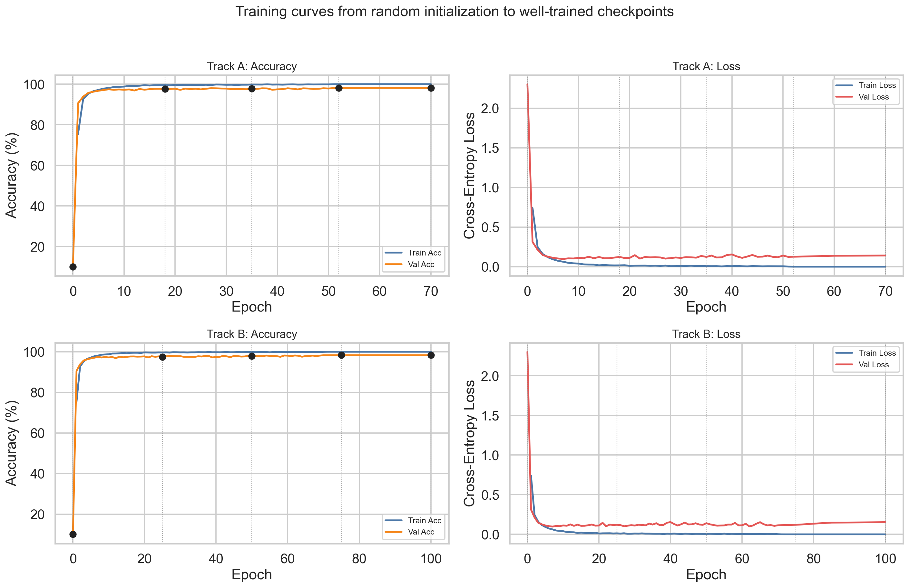

Data sources:

- `generated/step2_cora_mnist_point_a/history.csv`
- `generated/step2_cora_mnist_point_a/checkpoint_manifest.json`
- `generated/step2_cora_mnist_point_b/history.csv`
- `generated/step2_cora_mnist_point_b/checkpoint_manifest.json`

This part is not meant to provide a verification conclusion by itself. Its job is to provide training context for the checkpoints used later.

The two key points here are:

1. Track A and Track B both genuinely evolve from random initialization to well-trained models.
2. All later Step 3 and Step 4 checkpoints are sampled from these trajectories, not chosen arbitrarily.

### 1.2 About the TRADES Training Curve

It is reasonable to want `Track A / Track B / TRADES` training curves in the same opening section.  
However, the local workspace currently does not contain:

- `generated/step2_cora_mnist_trades_a/history.csv`
- `generated/step2_cora_mnist_trades_a/checkpoint_manifest.json`

So this report cannot honestly draw the TRADES training-loss curve yet.  
This is not an omission in interpretation; the source data simply has not been synchronized locally.

The safest way to tell the story for now is:

- use Track A and Track B in the training-curve section;
- move TRADES to the later cross-training comparison section, where exact Step 3 results are already available.

## 2. Act II: The Original Verification Protocol

### 2.1 How the Original Reference Points Were Chosen

The original Step 3 main experiments, including:

- `step3_full`
- `step3_seed42`
- `step3_trades`

all used the same reference-selection protocol:

> For each checkpoint independently, scan the MNIST test set in its original order and take the first 10 samples that this checkpoint classifies correctly.

Data sources:

- `generated/step3_full/reference_selection.json`
- `generated/step3_seed42/reference_selection.json`
- `generated/step3_trades/reference_selection.json`

This design has clear advantages:

- it is simple;
- it is fast;
- it lets us start checkpoint-level exact verification immediately.

But it also has a fundamental limitation:

- **the selected refs are likely different across checkpoints**

So the correct interpretation of Step 3 is:

> Under the protocol where each checkpoint uses its own first 10 correctly classified test samples, how does NAP behave?

Not:

> On the same fixed set of reference points, how does NAP change across checkpoints?

### 2.2 Step 3 Exact Main Result: Marabou

#### 2.2.1 Total Verified

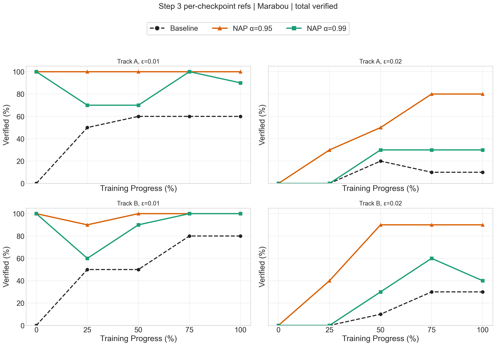

#### 2.2.2 Genuine Verified

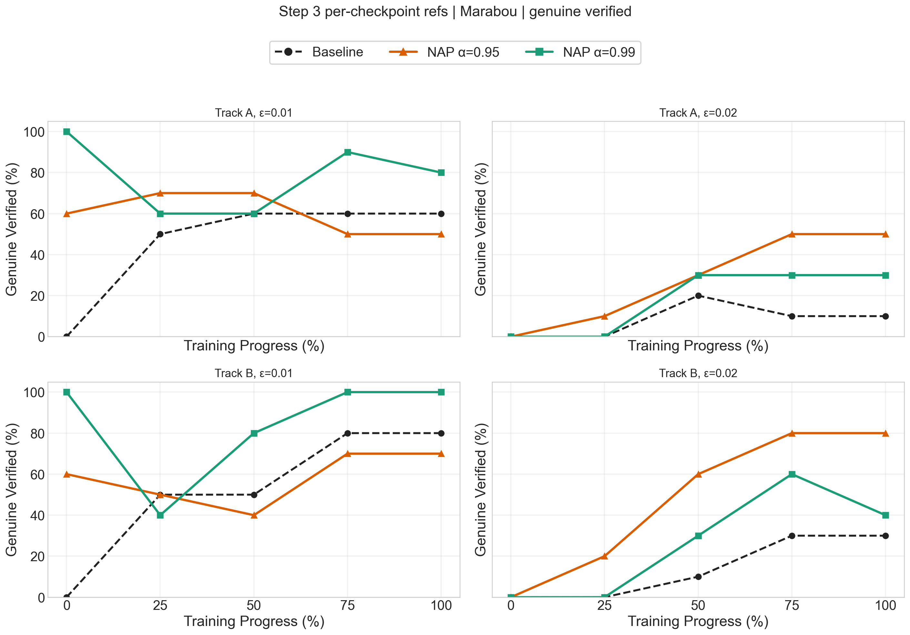

Data source:

- `generated/step3_full/results/coverage.csv`

I split the original line plot into two figures because the story becomes much clearer when these two quantities are separated:

1. `total verified`
   means the total verified rate including vacuous cases;
2. `genuine verified`
   means the truly interpretable part after vacuous cases are removed.

The core narrative here should be:

- the baseline becomes stronger as training progresses;
- NAP often brings additional verified gain at small radii, especially `epsilon=0.01` and part of `0.02`;
- if we only look at total verified, vacuous gain and genuine gain are mixed together;
- therefore, the final conclusion should be based primarily on `genuine verified`, with `total verified` as supporting context.

### 2.3 Step 3 Incomplete Contrast: auto_LiRPA

#### 2.3.1 Total Verified

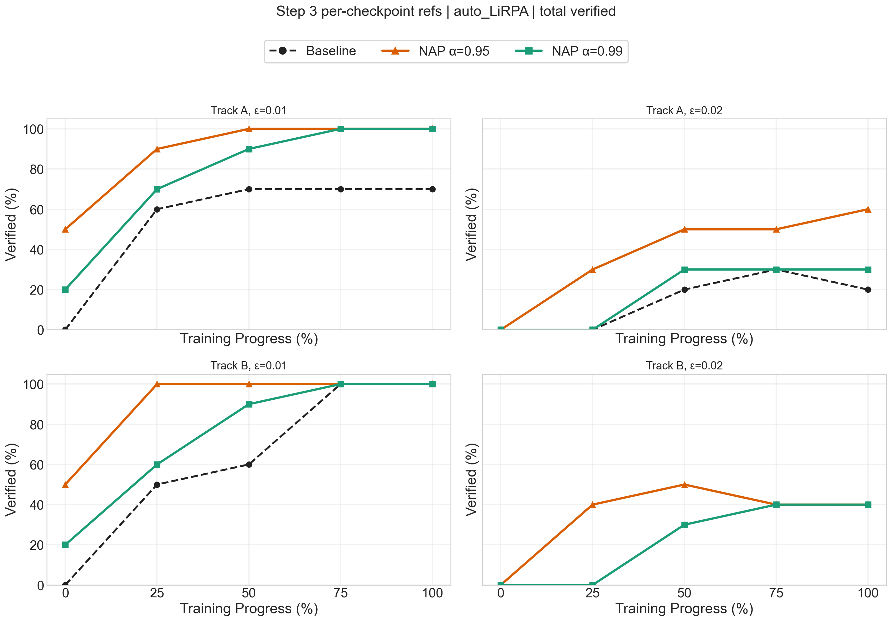

#### 2.3.2 Genuine Verified

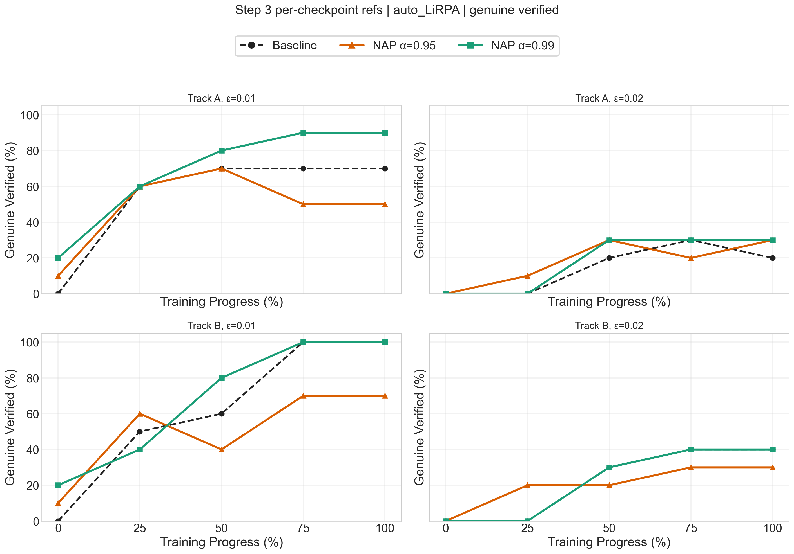

Data source:

- `generated/step3_auto_lirpa/results/coverage.csv`

One point must be stated explicitly:

- `step3_auto_lirpa` **does not reselect references**
- it reuses the `reference_selection.json` from `step3_full`

So these plots answer the following question:

> On the same Step 3 refs, does a fast incomplete verifier still reveal a structure similar to Marabou?

The right story here is:

- Marabou is the exact primary evidence;
- auto_LiRPA is a faster trend scanner;
- the two often agree in easy regions;
- they diverge more in boundary regions.

But the story must **not** be reversed into:

- auto_LiRPA replaces the exact Marabou conclusion.

## 3. Act III: Why the Reference-Point Logic Had to Be Rebuilt

### 3.1 Evolution of the Three Reference Protocols

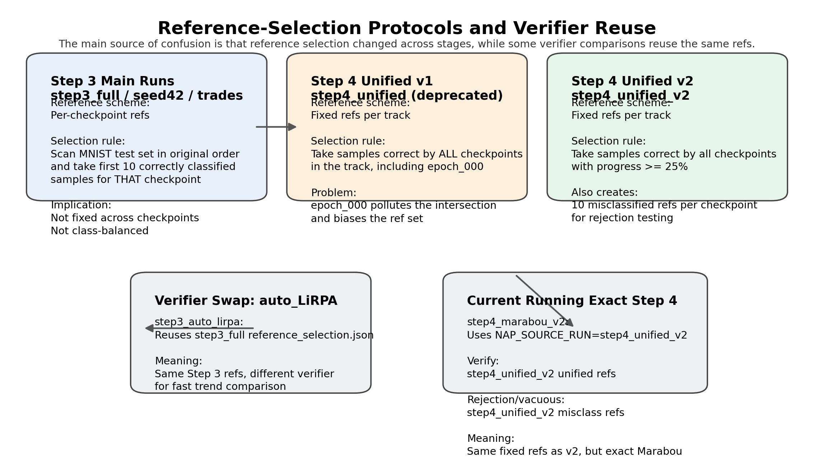

This is one of the key figures for understanding the whole experiment chain.

The story should be told like this:

1. Step 3 uses per-checkpoint refs.  
   So it is well-suited to answer what happens on the 10 points that each checkpoint itself finds easiest to certify.

2. That is not enough, because if the points differ across checkpoints, we cannot separate “the model changed” from “the samples changed.”

3. Therefore Step 4 moves to fixed references.

### 3.2 The Problem in v1: `epoch_000` Pollutes the Intersection

In the old `step4_unified`, fixed refs were defined as:

> samples that are classified correctly by every checkpoint in the same track.

This is logically cleaner than Step 3, but it has a real methodological flaw:

- `epoch_000` is included in the intersection

And `epoch_000` is still essentially a randomly initialized model.  
That makes the unified ref set strongly biased toward samples that the random model happens to guess correctly.

### 3.3 A Crucial Empirical Fact: `epoch_000` Almost Only Gets “9” Right

This is not just a theoretical concern; it is visible directly in the data.

For example, in `step3_full/reference_selection.json`:

- the first 10 refs for Track A at `epoch_000` all have true label `9`

This means:

- if `epoch_000` is included in the intersection,
- the fixed refs can easily degenerate into a small class-specific subset that the random model happens to classify correctly.

### 3.4 The v2 Correction

Therefore `step4_unified_v2` changes the selection logic to:

> require a sample to be classified correctly only by checkpoints with progress `>=25%`.

In other words:

- exclude `epoch_000` from the selection intersection;
- still keep `epoch_000` in the later evaluation stage.

This is a methodological correction, not a cosmetic parameter tweak.  
It changes the meaning of the fixed-reference set itself:

- whether the fixed refs are actually a representative shared reference set.

## 4. Act IV: Does the Trend Survive Under Fixed References?

### 4.1 Step 4 v2 Fixed Refs: Total Verified

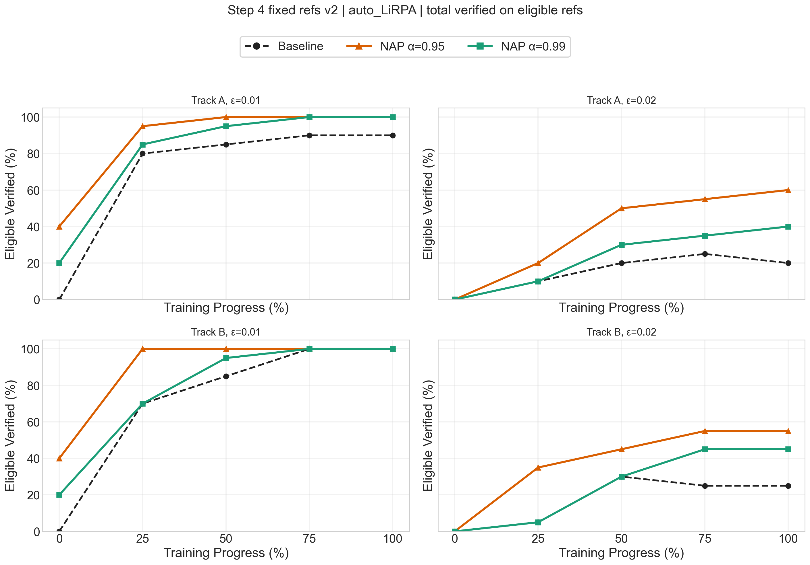

### 4.2 Step 4 v2 Fixed Refs: Genuine Verified

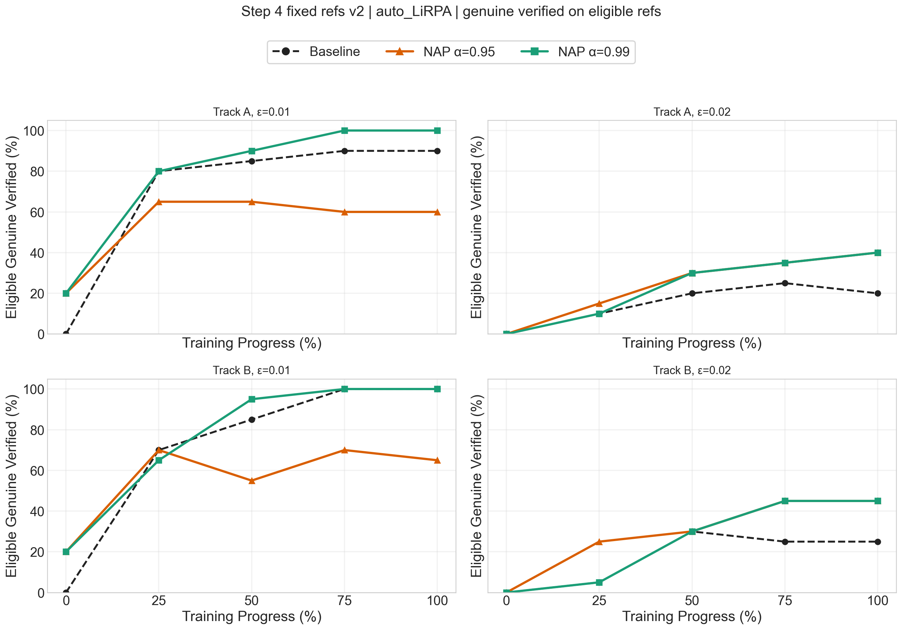

Data source:

- `generated/step4_unified_v2/results/coverage.csv`

Three boundaries must be kept explicit here:

1. this is `step4_unified_v2`;
2. the verifier here is `auto_LiRPA`;
3. the denominator is `eligible refs`.

So this section answers:

> On fixed unified refs, if we only count samples that are still eligible under the current checkpoint, does the NAP verified / genuine-verified trend still remain visible?

This section is very important in the story because:

- it is not the final exact verdict;
- but it is a methodological correction to Step 3;
- it tells us that the Step 3 trend is unlikely to be only a sample-selection artifact.

### 4.3 Step 4 Exact Verify: the Marabou Fixed-Ref Result Is Now Complete

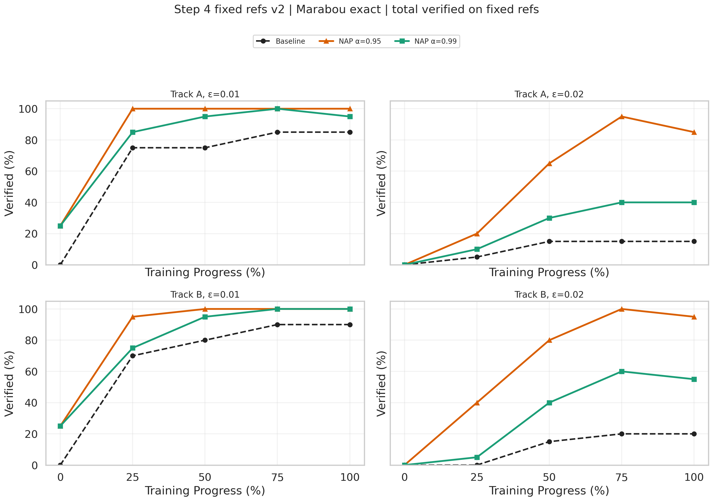

Data sources:

- `generated/step4_marabou_v2/results/coverage.csv`
- `generated/step4_marabou_v2/results/verify_all.csv`

The most important fact here is:

- `step4_marabou_v2` reuses the refs/manifests from `step4_unified_v2`;
- therefore it evaluates **the same fixed refs** as Sections 4.1 and 4.2;
- what changes is not the reference protocol, but the verifier: from auto_LiRPA to Marabou exact.

The easiest point to misread should be stated explicitly:

- `verify_all.csv` contains `180` `misclassified` cases;
- this is not a script bug;
- it happens because `epoch_000` is excluded from ref selection but still retained during evaluation.

If we focus only on the checkpoints that should actually be compared, i.e. `progress >= 25%`, the mean exact verified rates are:

| Method | `ε=0.01` | `ε=0.02` |
| --- | ---: | ---: |
| Baseline | 81.25% | 13.12% |
| NAP `α=0.95` | 99.38% | 72.50% |
| NAP `α=0.99` | 93.12% | 35.00% |

This materially upgrades the Step 4 story:

- on fixed refs, the NAP-over-baseline advantage is now supported by exact verification;
- the strongest advantage appears exactly where you cared most, namely `ε=0.02`;
- this means the main Step 3 trend is not just an auto_LiRPA artifact, nor merely a reference-selection artifact.

But the boundary must remain explicit:

- this exact Step 4 positive-ref path currently reports only `verified`;
- it does not split positive fixed-ref verification into `genuine` versus `vacuous` the way Section 4.2 does.

So the safest wording is:

> Step 4 exact now confirms the fixed-ref NAP advantage;  
> the `genuine / vacuous` semantic decomposition is still mainly explained by `step4_unified_v2`.

### 4.4 On the Same Fixed Refs, View Exact Verified and Genuine Context in the Same Layout

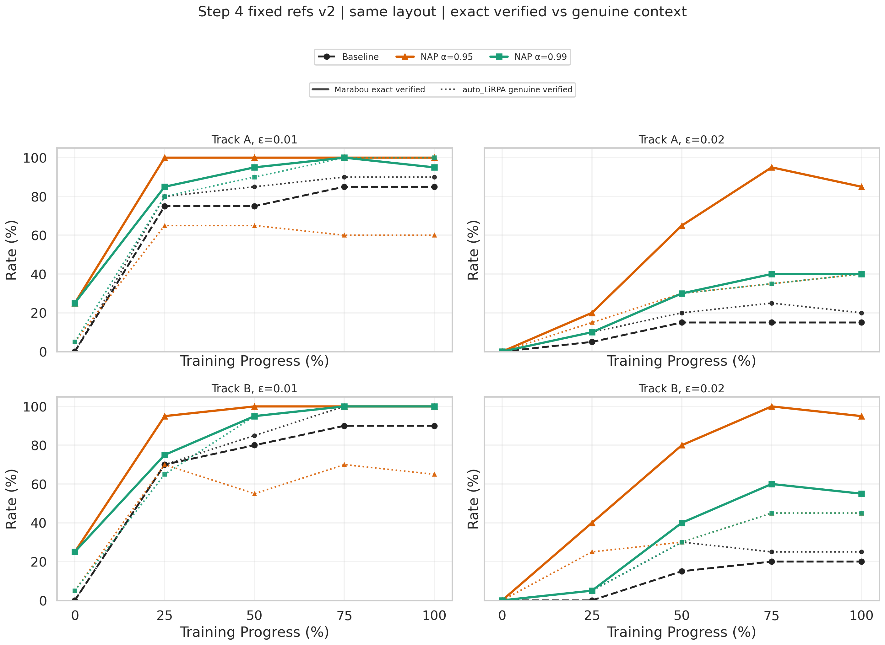

Data sources:

- `generated/step4_unified_v2/results/coverage.csv`
- `generated/step4_marabou_v2/results/coverage.csv`

This figure keeps the same visual layout as Sections 4.1 and 4.2, but changes the line semantics:

- solid lines of the same color denote `Marabou exact verified`
- dotted lines of the same color denote `auto_LiRPA genuine verified`

It is most useful for two questions:

1. whether the fixed-ref exact verified trend broadly moves with the genuine trend;
2. how much of the `α=0.95` versus `α=0.99` difference may be tied to the `vacuous` decomposition.

The main visual takeaways are:

- under the baseline, Marabou and auto_LiRPA are very close;
- under `α=0.99`, exact verified is also quite close to auto_LiRPA genuine;
- under `α=0.95`, Marabou exact verified is substantially higher than auto_LiRPA genuine, which is exactly where `step4_unified_v2` is still needed to explain the vacuous structure.

## 5. Act V: What Does NAP Do to Misclassified Samples?

### 5.1 Misclassified-Sample Rejection

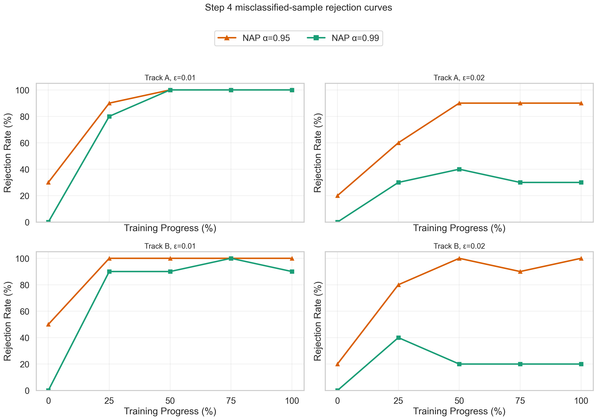

Data source:

- `generated/step4_unified_v2/results/rejection_summary.csv`

This section addresses the second supervisor-driven Step 4 question:

> For samples that the model originally misclassifies, does NAP directly reject the local region around them?

This is not the same question as “does the verified rate increase?”

It is closer to asking:

- whether NAP tends to carve out empty regions around wrongly classified samples;
- whether `alpha=0.95` and `alpha=0.99` behave differently in rejection.

So the role of this figure in the story is:

- it shows that NAP is not only helping on correctly classified samples;
- it also reveals the repulsive behavior of NAP near misclassified samples.

### 5.2 Rejection as an Object-Level Gallery

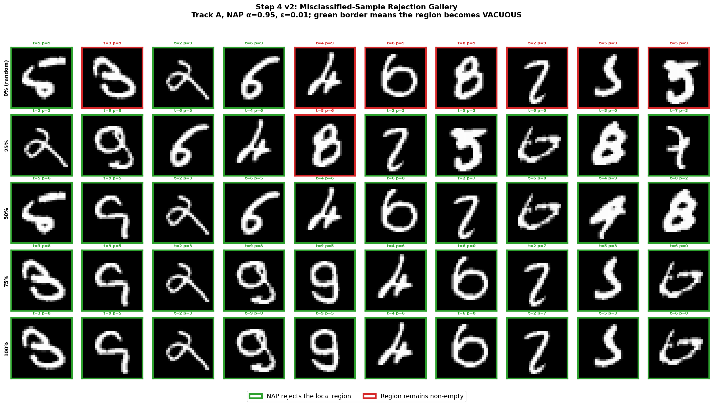

Data sources:

- `generated/step4_unified_v2/manifests/rejection.csv`
- `generated/step4_unified_v2/results/rejection_all.csv`

The curve above tells us that the rejection rate changes, but it is still an aggregate statistic.  
To make the story understandable, it helps to add a truly object-level figure.

This gallery does the following:

- each row corresponds to one checkpoint;
- each column corresponds to one misclassified reference;
- a green border means that the point becomes `VACUOUS` under the current NAP constraints, i.e. the local region is cut away entirely;
- a red border means the region remains non-empty.

This is more intuitive than the rejection-rate curve because it shows:

- rejection is not an abstract percentage; it happens on concrete wrong samples;
- the behavior becomes more systematic as training progresses;
- a green border does **not** mean the model has reclassified the sample correctly; it only means NAP has emptied the local region around it.

### 5.3 Step 4 Exact Rejection: This Part of the Story Is Now Also Completed by Marabou

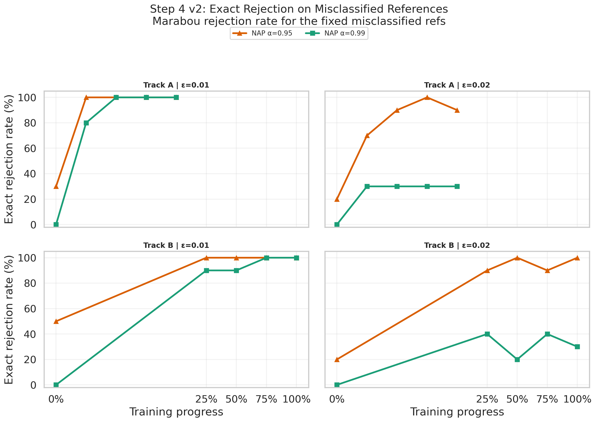

Data sources:

- `generated/step4_marabou_v2/results/rejection_summary.csv`
- `generated/step4_marabou_v2/results/rejection_all.csv`

These 400 exact rejection tasks are now complete.  
Aggregated by `(alpha, epsilon)`, the exact results are:

| Alpha | `ε=0.01` | `ε=0.02` |
| --- | --- | --- |
| `α=0.95` | `88 rejected / 4 non-empty / 8 T/o` | `77 / 10 / 13` |
| `α=0.99` | `76 / 14 / 10` | `25 / 23 / 52` |

The story here is very clear:

- `α=0.95` rejects misclassified refs very aggressively;
- `α=0.99` is also strong at `0.01`, but becomes much more conservative at `0.02`;
- `α=0.99, ε=0.02` is also substantially harder, with many more timeouts.

More importantly, once we align the exact rejection results with the auto_LiRPA rejection curves in Section 5.1, the mean rejection-rate gap stays within roughly `1-3` percentage points.  
In other words:

> the Step 4 rejection story does not only hold under incomplete verification;  
> it is now also largely confirmed by exact Marabou.

## 6. Act VI: What Do the Fixed References Themselves Look Like?

### 6.1 First Look at the Whole Set of Fixed Refs

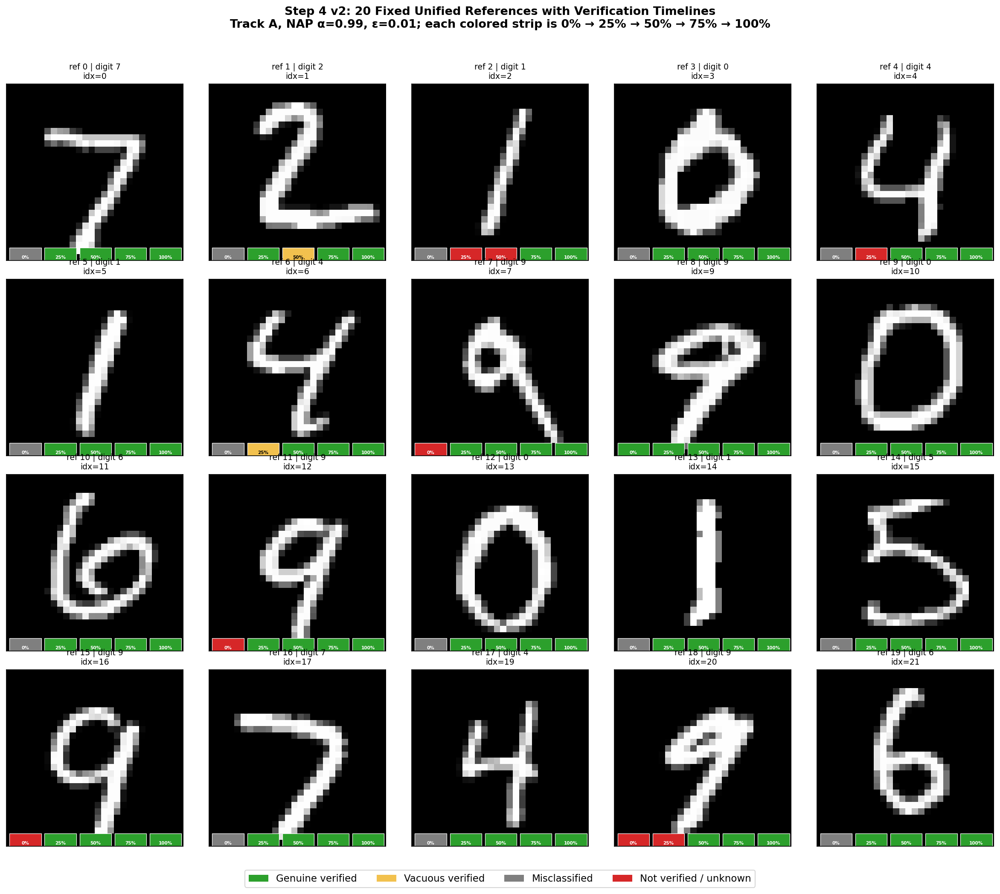

Data sources:

- `generated/step4_unified_v2/unified_refs.json`
- `generated/step4_unified_v2/results/verify_all.csv`

This figure directly borrows the most storytelling-friendly display style from `vis_step4_claude.ipynb`:

- all 20 unified refs are shown directly as images;
- each image has a five-segment color strip under it, corresponding to `0% → 25% → 50% → 75% → 100%`;
- the displayed configuration is fixed to `Track A, NAP α=0.99, ε=0.01`.

Its main advantage is that the reader does **not** need to understand quantiles, IQR, or frontier epsilon first.  
Instead, two key facts become visible immediately:

1. Many refs are gray at `0%`.  
   This is not a bug; it is exactly the design of `step4_unified_v2`:  
   `epoch_000` is excluded from reference selection, but still kept during evaluation.  
   So fixed refs are often `misclassified` at `epoch_000`.

2. The same ref set later splits into three different states:
   - green: genuine verified
   - yellow: vacuous verified
   - red: not verified / unknown

This is much better for storytelling than the previous frontier-distribution figure, because here we can see:

- which sample is changing;
- at which checkpoint the change starts;
- whether the change is genuine gain or vacuous gain.

### 6.2 Then Look at One Single Reference in Detail

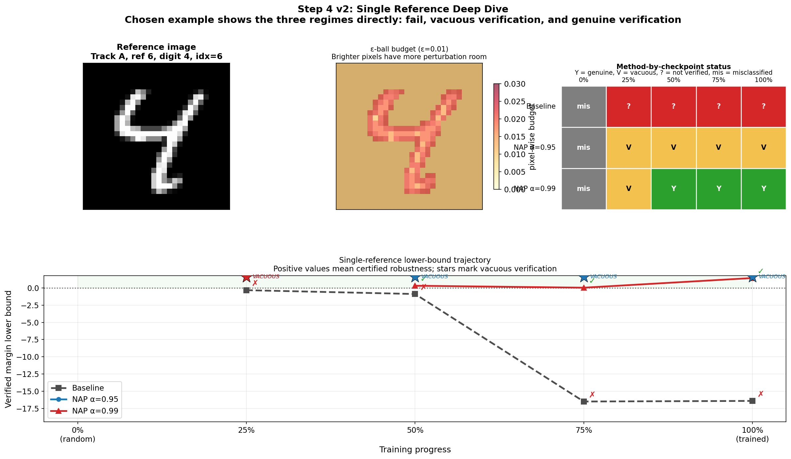

Data sources:

- `generated/step4_unified_v2/unified_refs.json`
- `generated/step4_unified_v2/results/verify_all.csv`

This figure uses `Track A, ref 6, digit 4, idx=6`.  
It was not chosen because it is visually convenient, but because it exposes three distinct mechanisms at the same time:

- baseline: never truly crosses `0`, so robustness is never certified;
- `α=0.95`: becomes vacuous from `25%` onward;
- `α=0.99`: is vacuous at `25%`, then becomes genuinely verified from `50%` onward.

From top to bottom, the figure tells a three-layer story:

1. The top-left panel shows the reference itself.  
   This grounds the discussion in a concrete digit instead of an abstract ID.

2. The top-middle panel shows the pixel-wise budget for `ε=0.01`.  
   It reminds the reader that the verifier is actually working over a clipped input box in `[0,1]`, not over an abstract scalar radius alone.

3. The top-right panel is a method-by-checkpoint status matrix.  
   This turns the line plot into a state table:  
   `mis / ? / V / Y` make it immediately visible how the same ref evolves under different methods.

4. The bottom panel is the lower-bound trajectory.  
   This is the panel that actually explains *why* a case moves from not verified to verified.  
   For genuine points, we care about whether the `min lower bound` crosses `0`;  
   for vacuous points, we mark them with stars instead of inventing a fake numeric value.

This single-reference figure is better for storytelling than an aggregate curve when you want to say:

> NAP does not only change the verified rate; it also changes *how* verification becomes true.

More concretely:

- sometimes it makes a previously negative lower bound become positive, yielding genuine verification;
- sometimes it makes the local region itself become empty, yielding vacuous verification;
- both cases are counted as `verified` in aggregate plots, but their semantics are very different.

### 6.3 Why the Original Frontier Distribution Is No Longer the Main Figure

The old frontier figure was not wrong.  
It is still a valid reference-level distribution summary and remains useful in the full notebook.

But for a story-driven report, it has two problems:

1. It first requires the reader to understand a derived quantity:  
   “what is the last still-genuine epsilon for a ref?”

2. It collapses away object-level information.  
   The reader cannot directly see:
   - which refs are already gray at `epoch_000`;
   - which refs are genuine;
   - which refs are only vacuous;
   - which exact sample changes at which checkpoint.

So in this report, I removed the frontier distribution from the main narrative and replaced it with two figures closer to `vis_step4_claude.ipynb`:

- one figure for the object-level timeline of the full fixed-ref set;
- one figure for a deep dive into a single ref.

## 7. Act VII: How Do the NAP Rules Themselves Change?

### 7.1 Total Rule Burden

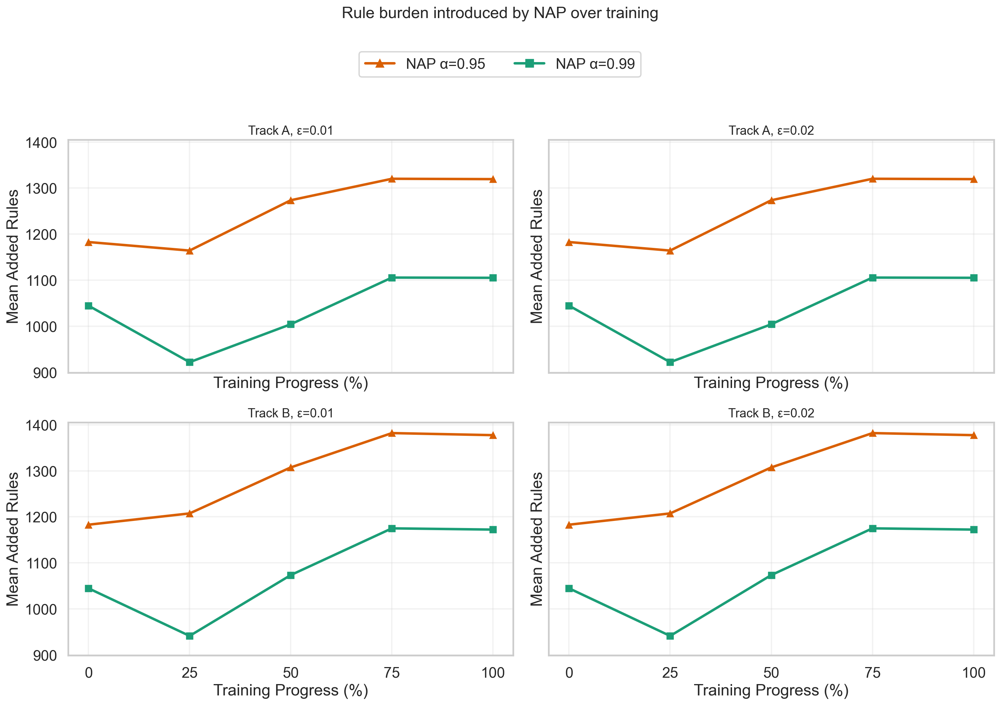

Data source:

- `generated/step3_full/results/verify_all.csv`

This figure answers:

> How many NAP constraints is the verifier actually carrying during verification?

It supports a key observation:

- `alpha=0.95` usually adds more rules than `alpha=0.99`;
- the rule count rises clearly in early and middle training;
- from `75% -> 100%`, the total count is mostly saturated.

### 7.2 Rule Polarity: ALWAYS_ON vs ALWAYS_OFF

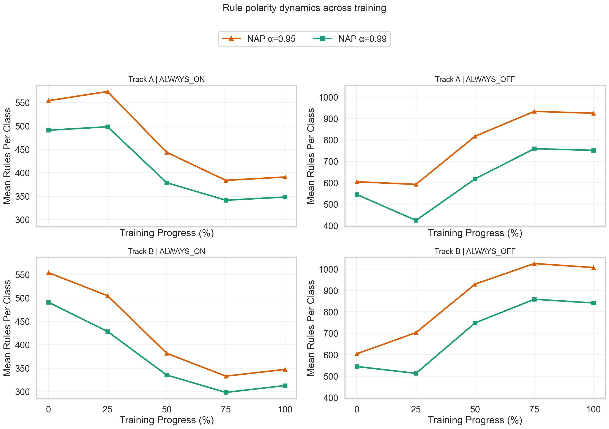

Data source:

- `generated/step3_full/rules/*/*/alpha_*/unary_rules.csv`

This figure is meant to answer a finer-grained question:

> Even if the total rule count saturates late in training, is the internal composition of the rules still changing?

It lets the story become more precise:

- instead of saying only “the rules stop growing,”
- we can ask:
  - does `ALWAYS_ON` keep changing?
  - does `ALWAYS_OFF` keep changing?
  - which rule type mainly drives the difference between the two alpha settings?

So if you later want to discuss overconfidence or geometric changes, this figure is more informative than total rule count alone.

## 8. Act VIII: Does the Same Pattern Survive Across Training Modes?

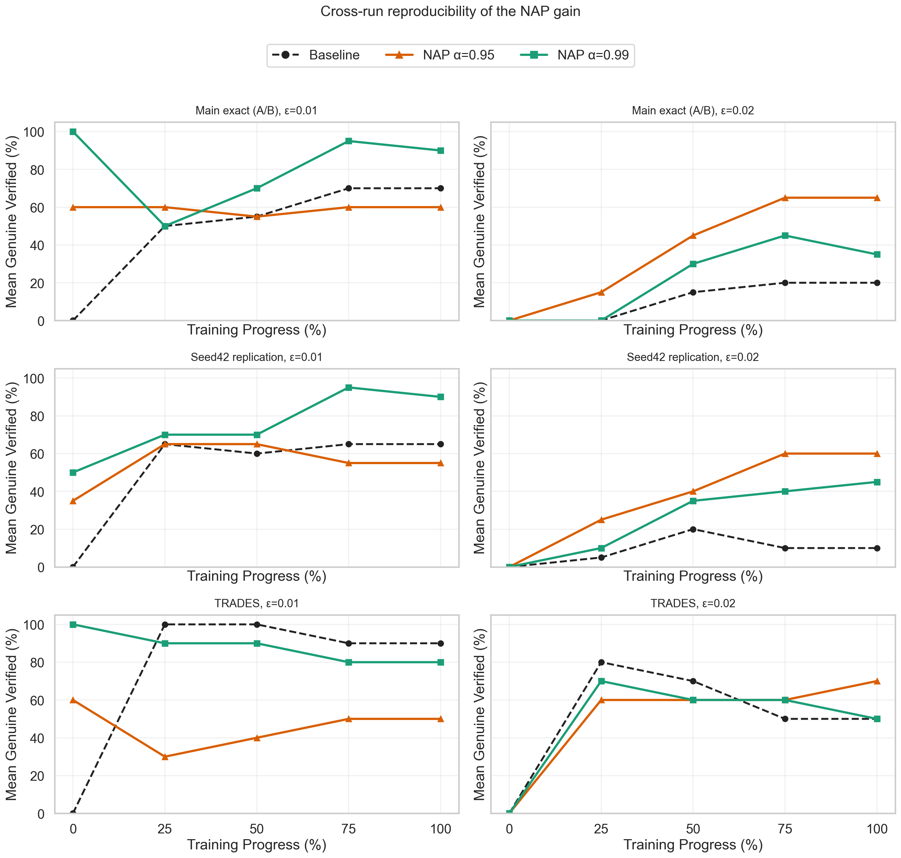

Data sources:

- `generated/step3_full/results/coverage.csv`
- `generated/step3_seed42/results/coverage.csv`
- `generated/step3_trades/results/coverage.csv`

This section asks:

> Does the NAP gain disappear completely if we change the seed or the training recipe?

The safest story at the moment is:

- different runs do have different absolute numbers;
- the baseline strength also differs across runs;
- but the main small-radius NAP-vs-baseline trend is not completely overturned.

This means:

- the phenomenon is not an accident unique to `step3_full`;
- it shows a meaningful degree of stability across seeds and training recipes.

## 9. The Strongest Current Story Conclusion

Within the current data boundary, the strongest narrative chain is:

1. Training continuously improves predictive performance, but verification behavior does not improve in a simple monotone way.
2. The original Step 3 results already show that NAP can bring exact verified gain at small radii, especially `epsilon=0.01` and part of `0.02`.
3. However, Step 3 uses per-checkpoint refs, so a sample-selection artifact cannot be fully ruled out there.
4. This motivates the fixed-reference Step 4 design.
5. `step4_unified_v2` shows that after correcting the ref logic and controlling the reference points, the NAP trend still remains visible.
6. `step4_marabou_v2` further shows that on **the same fixed refs**, this trend is also supported by exact verification and exact rejection.
7. At the same time, the late-training behavior looks more like:
   - saturation in total rule count,
   - continued change in rule composition and region geometry,
   - continued redistribution between genuine and vacuous verification.

## 10. What We Still Must Not Overclaim

There are three places where the story still has to remain disciplined:

1. We must not interpret all exact Step 4 verified gains as genuine region expansion.  
   On the positive fixed refs, `step4_marabou_v2` currently reports `verified`, but does not independently split `genuine` from `vacuous`.

2. We must not directly compare absolute verified percentages between Step 3 and Step 4.  
   Their reference bases are different:
   - Step 3: per-checkpoint refs
   - Step 4: fixed unified refs

3. We must not claim that late-training overconfidence has already been fully proven.  
   The safer wording is still:
   - late training appears to involve changes in region geometry and vacuity behavior;
   - this is compatible with an overconfidence tendency;
   - but the current evidence is still about geometry/vacuity behavior, not a completed causal proof.

## 11. What `step4_marabou_v2` Changes Now

Now that `step4_marabou_v2` is complete, the most important upgrades to the story are:

1. The fixed-reference trend can now be described as:
   - `auto_LiRPA` first exposes the `genuine / vacuous` structure;
   - `Marabou exact` then confirms that the fixed-ref trend is not an incomplete-verification illusion.

2. The rejection story can now also be stated as an exact conclusion:
   - `α=0.95` is more aggressive and rejects more strongly;
   - `α=0.99` is more conservative, especially at `ε=0.02`, where timeouts are much more common.

So the full story can now be upgraded to:

> Step 3 provides the exact main result under per-checkpoint refs;  
> Step 4 provides the methodological correction under fixed refs;  
> and `step4_marabou_v2` now pins down that fixed-ref story with exact verification and exact rejection.
