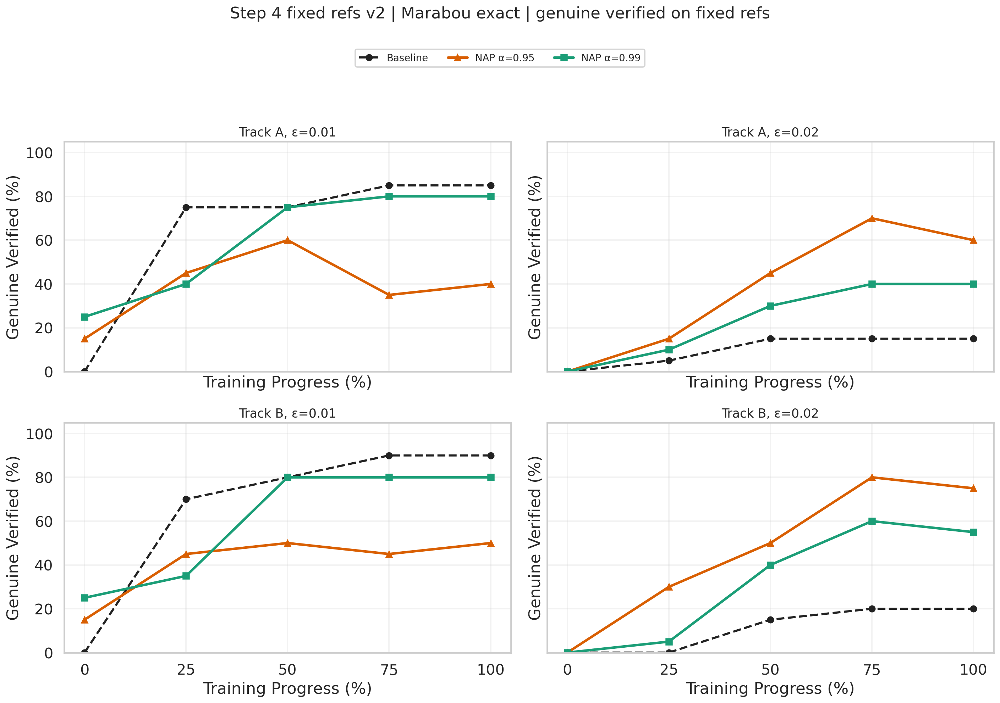
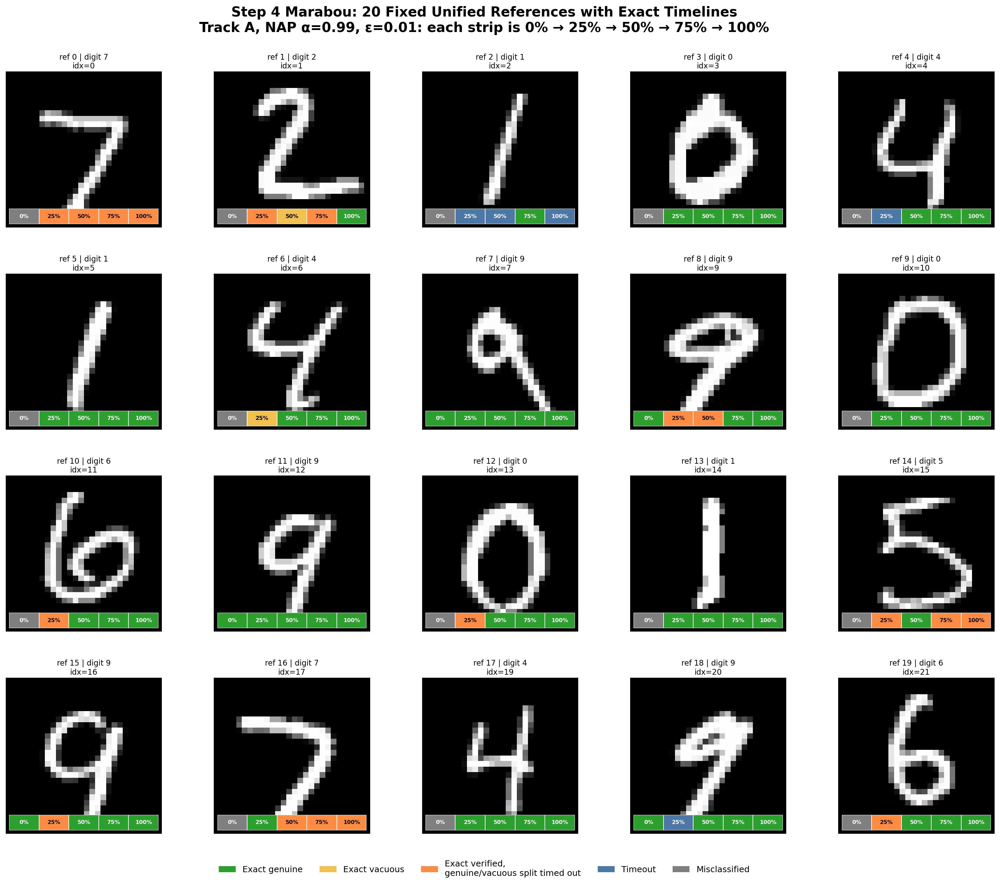
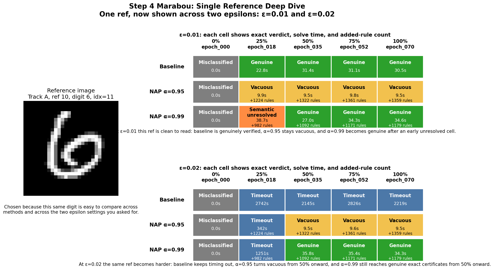

# NAP Verification Story Report

This document is not a simple figure catalog. It is an English narrative version of the current experiment story, organized in a paper-like structure.  
The goal is not to list every figure, but to make the whole experimental chain easier to explain:

1. how the models were trained;
2. what the initial verification protocol was;
3. why the reference-point logic had to be redesigned;
4. what the fixed-reference results say after the redesign;
5. what NAP changes beyond the verified rate itself;
6. whether the same phenomena remain visible across seeds and training recipes.

## 0. Scope of This Report

This narrative report currently includes results from:

- `generated/step3_full`
- `generated/step3_seed42`
- `generated/step3_trades`
- `generated/step3_auto_lirpa`
- `generated/step4_unified_v2`
- `generated/step4_marabou_v2`

Therefore, in the story below:

- Step 3 can be discussed using **Marabou exact** results;
- Step 4 can now be discussed using both:
  - **fixed-reference + auto_LiRPA** as a dense trend scanner for the `genuine / vacuous` structure;
  - **fixed-reference + Marabou exact** for exact verify / genuine / rejection conclusions;
- on the positive fixed refs, `step4_marabou_v2` now also provides an exact semantic split, although some cells still remain `semantic_unresolved`.

## 1. Act I: What Happens During Training?

### 1.1 Training Curves for Track A and Track B

Data sources:

- `generated/step2_cora_mnist_point_a/history.csv`
- `generated/step2_cora_mnist_point_a/checkpoint_manifest.json`
- `generated/step2_cora_mnist_point_b/history.csv`
- `generated/step2_cora_mnist_point_b/checkpoint_manifest.json`

This part is not meant to provide a verification conclusion by itself. Its job is to provide training context for the checkpoints used later.

The two key points here are:

1. Track A and Track B both genuinely evolve from random initialization to well-trained models.
2. All later Step 3 and Step 4 checkpoints are sampled from these trajectories, not chosen arbitrarily.

### 1.2 About the TRADES Training Curve

It is reasonable to want `Track A / Track B / TRADES` training curves in the same opening section.  
However, the local workspace currently does not contain:

- `generated/step2_cora_mnist_trades_a/history.csv`
- `generated/step2_cora_mnist_trades_a/checkpoint_manifest.json`

So this report cannot honestly draw the TRADES training-loss curve yet.  
This is not an omission in interpretation; the source data simply has not been synchronized locally.

The safest way to tell the story for now is:

- use Track A and Track B in the training-curve section;
- move TRADES to the later cross-training comparison section, where exact Step 3 results are already available.

## 2. Act II: The Original Verification Protocol

### 2.1 How the Original Reference Points Were Chosen

The original Step 3 main experiments, including:

- `step3_full`
- `step3_seed42`
- `step3_trades`

all used the same reference-selection protocol:

> For each checkpoint independently, scan the MNIST test set in its original order and take the first 10 samples that this checkpoint classifies correctly.

Data sources:

- `generated/step3_full/reference_selection.json`
- `generated/step3_seed42/reference_selection.json`
- `generated/step3_trades/reference_selection.json`

This design has clear advantages:

- it is simple;
- it is fast;
- it lets us start checkpoint-level exact verification immediately.

But it also has a fundamental limitation:

- **the selected refs are likely different across checkpoints**

So the correct interpretation of Step 3 is:

> Under the protocol where each checkpoint uses its own first 10 correctly classified test samples, how does NAP behave?

Not:

> On the same fixed set of reference points, how does NAP change across checkpoints?

### 2.2 Step 3 Exact Main Result: Marabou

#### 2.2.1 Total Verified

#### 2.2.2 Genuine Verified

Data source:

- `generated/step3_full/results/coverage.csv`

I split the original line plot into two figures because the story becomes much clearer when these two quantities are separated:

1. `total verified`
   means the total verified rate including vacuous cases;
2. `genuine verified`
   means the truly interpretable part after vacuous cases are removed.

The core narrative here should be:

- the baseline becomes stronger as training progresses;
- NAP often brings additional verified gain at small radii, especially `epsilon=0.01` and part of `0.02`;
- if we only look at total verified, vacuous gain and genuine gain are mixed together;
- therefore, the final conclusion should be based primarily on `genuine verified`, with `total verified` as supporting context.

### 2.3 Step 3 Incomplete Contrast: auto_LiRPA

#### 2.3.1 Total Verified

#### 2.3.2 Genuine Verified

Data source:

- `generated/step3_auto_lirpa/results/coverage.csv`

One point must be stated explicitly:

- `step3_auto_lirpa` **does not reselect references**
- it reuses the `reference_selection.json` from `step3_full`

So these plots answer the following question:

> On the same Step 3 refs, does a fast incomplete verifier still reveal a structure similar to Marabou?

The right story here is:

- Marabou is the exact primary evidence;
- auto_LiRPA is a faster trend scanner;
- the two often agree in easy regions;
- they diverge more in boundary regions.

But the story must **not** be reversed into:

- auto_LiRPA replaces the exact Marabou conclusion.

## 3. Act III: Why the Reference-Point Logic Had to Be Rebuilt

### 3.1 Evolution of the Three Reference Protocols

The story should be told like this:

1. Step 3 uses per-checkpoint refs.  
   So it is well-suited to answer what happens on the 10 points that each checkpoint itself finds easiest to certify.

2. That is not enough, because if the points differ across checkpoints, we cannot separate “the model changed” from “the samples changed.”

3. Therefore Step 4 moves to fixed references.

### 3.2 The Problem in v1: `epoch_000` Pollutes the Intersection

In the old `step4_unified`, fixed refs were defined as:

> samples that are classified correctly by every checkpoint in the same track.

This is logically cleaner than Step 3, but it has a real methodological flaw:

- `epoch_000` is included in the intersection

And `epoch_000` is still essentially a randomly initialized model.  
That makes the unified ref set strongly biased toward samples that the random model happens to guess correctly.

### 3.3 A Crucial Empirical Fact: `epoch_000` Almost Only Gets “9” Right

This is not just a theoretical concern; it is visible directly in the data.

For example, in `step3_full/reference_selection.json`:

- the first 10 refs for Track A at `epoch_000` all have true label `9`

This means:

- if `epoch_000` is included in the intersection,
- the fixed refs can easily degenerate into a small class-specific subset that the random model happens to classify correctly.

### 3.4 The v2 Correction

Therefore `step4_unified_v2` changes the selection logic to:

> require a sample to be classified correctly only by checkpoints with progress `>=25%`.

In other words:

- exclude `epoch_000` from the selection intersection;
- still keep `epoch_000` in the later evaluation stage.

This is a methodological correction, not a cosmetic parameter tweak.  
It changes the meaning of the fixed-reference set itself:

- whether the fixed refs are actually a representative shared reference set.

## 4. Act IV: Does the Trend Survive Under Fixed References?

### 4.1 Step 4 v2 Fixed Refs: Total Verified

### 4.2 Step 4 v2 Fixed Refs: Genuine Verified

Data source:

- `generated/step4_unified_v2/results/coverage.csv`

Three boundaries must be kept explicit here:

1. this is `step4_unified_v2`;
2. the verifier here is `auto_LiRPA`;
3. the denominator is `eligible refs`.

So this section answers:

> On fixed unified refs, if we only count samples that are still eligible under the current checkpoint, does the NAP verified / genuine-verified trend still remain visible?

This section is very important in the story because:

- it is not the final exact verdict;
- but it is a methodological correction to Step 3;
- it tells us that the Step 3 trend is unlikely to be only a sample-selection artifact.

### 4.3 Step 4 Exact Verify: Marabou Total Verified on Fixed Refs

Data sources:

- `generated/step4_marabou_v2/results/coverage.csv`
- `generated/step4_marabou_v2/results/verify_all.csv`

The most important fact here is:

- `step4_marabou_v2` reuses the refs/manifests from `step4_unified_v2`;
- therefore it evaluates **the same fixed refs** as Sections 4.1 and 4.2;
- what changes is not the reference protocol, but the verifier: from auto_LiRPA to Marabou exact.

The easiest point to misread should be stated explicitly:

- `verify_all.csv` contains `180` `misclassified` cases;
- this is not a script bug;
- it happens because `epoch_000` is excluded from ref selection but still retained during evaluation.

If we focus only on the checkpoints that should actually be compared, i.e. `progress >= 25%`, the mean exact verified rates are:

| Method | `ε=0.01` | `ε=0.02` |
| --- | ---: | ---: |
| Baseline | 81.25% | 13.12% |
| NAP `α=0.95` | 99.38% | 72.50% |
| NAP `α=0.99` | 93.12% | 35.00% |

This materially upgrades the Step 4 story:

- on fixed refs, the NAP-over-baseline advantage is now supported by exact total verification;
- the strongest advantage appears exactly where you cared most, namely `ε=0.02`;
- this means the main Step 3 trend is not just an auto_LiRPA artifact, nor merely a reference-selection artifact.

But total verified is not yet the final semantic answer.  
For NAP, some `Y` results may still be vacuous.

### 4.4 Step 4 Exact Verify: Marabou Genuine Verified on Fixed Refs

Data sources:

- `generated/step4_marabou_v2/results/coverage.csv`
- `generated/step4_marabou_v2/results/positive_vacuous/`

This now decomposes exact positive-ref results into:

- `genuine`
- `vacuous`
- `semantic_unresolved`

For `progress >= 25%`, the mean exact genuine rates are:

| Method | `ε=0.01` | `ε=0.02` |
| --- | ---: | ---: |
| Baseline | 81.25% | 13.12% |
| NAP `α=0.95` | 46.25% | 53.12% |
| NAP `α=0.99` | 68.75% | 35.00% |

This sharpens the Step 4 exact takeaway:

- at `ε=0.02`, both alphas show clear exact genuine help;
- at `ε=0.01`, the total gain of `α=0.95` is mostly not genuine;
- at `ε=0.01`, `α=0.99` is still a conservative lower bound because some cases remain `semantic_unresolved`.

### 4.5 On the Same Fixed Refs, Compare Exact Genuine and auto_LiRPA Genuine in the Same Layout

Data sources:

- `generated/step4_unified_v2/results/coverage.csv`
- `generated/step4_marabou_v2/results/coverage.csv`

This figure keeps the same visual layout as Sections 4.1 and 4.2, but now compares genuine against genuine:

- solid lines of the same color denote `Marabou exact genuine`
- dotted lines of the same color denote `auto_LiRPA genuine verified`

It is most useful for two questions:

1. whether the fixed-ref exact genuine trend broadly agrees with the auto_LiRPA genuine trend;
2. where the exact semantic decomposition is noticeably more conservative than the incomplete trend.

The main visual takeaways are:

- under the baseline, the two genuine curves coincide;
- under `α=0.99, ε=0.02`, they also agree closely;
- under `α=0.95, ε=0.01`, exact genuine is clearly lower than auto_LiRPA genuine, showing that the exact vacuity decomposition is stricter here.

## 5. Act V: What Does NAP Do to Misclassified Samples?

### 5.1 Misclassified-Sample Rejection

Data source:

- `generated/step4_unified_v2/results/rejection_summary.csv`

This section addresses the second supervisor-driven Step 4 question:

> For samples that the model originally misclassifies, does NAP directly reject the local region around them?

This is not the same question as “does the verified rate increase?”

It is closer to asking:

- whether NAP tends to carve out empty regions around wrongly classified samples;
- whether `alpha=0.95` and `alpha=0.99` behave differently in rejection.

So the role of this figure in the story is:

- it shows that NAP is not only helping on correctly classified samples;
- it also reveals the repulsive behavior of NAP near misclassified samples.

### 5.2 Rejection as an Object-Level Gallery

Data sources:

- `generated/step4_unified_v2/manifests/rejection.csv`
- `generated/step4_unified_v2/results/rejection_all.csv`

The curve above tells us that the rejection rate changes, but it is still an aggregate statistic.  
To make the story understandable, it helps to add a truly object-level figure.

This gallery does the following:

- each row corresponds to one checkpoint;
- each column corresponds to one misclassified reference;
- a green border means that the point becomes `VACUOUS` under the current NAP constraints, i.e. the local region is cut away entirely;
- a red border means the region remains non-empty.

This is more intuitive than the rejection-rate curve because it shows:

- rejection is not an abstract percentage; it happens on concrete wrong samples;
- the behavior becomes more systematic as training progresses;
- a green border does **not** mean the model has reclassified the sample correctly; it only means NAP has emptied the local region around it.

### 5.3 Step 4 Exact Rejection: This Part of the Story Is Now Also Completed by Marabou

Data sources:

- `generated/step4_marabou_v2/results/rejection_summary.csv`
- `generated/step4_marabou_v2/results/rejection_all.csv`

The x-axis here is the normalized training-progress axis used throughout this report.  
So for Track A, `epoch_070` is shown at `100%`, not at raw epoch value `70`.

These 400 exact rejection tasks are now complete.  
Aggregated by `(alpha, epsilon)`, the exact results are:

| Alpha | `ε=0.01` | `ε=0.02` |
| --- | --- | --- |
| `α=0.95` | `88 rejected / 4 non-empty / 8 T/o` | `77 / 10 / 13` |
| `α=0.99` | `76 / 14 / 10` | `25 / 23 / 52` |

The story here is very clear:

- `α=0.95` rejects misclassified refs very aggressively;
- `α=0.99` is also strong at `0.01`, but becomes much more conservative at `0.02`;
- `α=0.99, ε=0.02` is also substantially harder, with many more timeouts.

More importantly, once we align the exact rejection results with the auto_LiRPA rejection curves in Section 5.1, the mean rejection-rate gap stays within roughly `1-3` percentage points.  
In other words:

> the Step 4 rejection story does not only hold under incomplete verification;  
> it is now also largely confirmed by exact Marabou.

## 6. Act VI: What Do the Fixed References Themselves Look Like?

### 6.1 First Look at the Whole Set of Fixed Refs Under Marabou Exact

Data sources:

- `generated/step4_unified_v2/unified_refs.json`
- `generated/step4_marabou_v2/results/verify_all.csv`

This keeps the same object-level display style as before, but the colored strips now come from `step4_marabou_v2`, not `step4_unified_v2`.

The displayed configuration is still fixed to `Track A, NAP α=0.99, ε=0.01`.

This is important because the exact state space is now richer than the old auto_LiRPA picture:

- gray: `misclassified`
- green: exact `genuine`
- yellow: exact `vacuous`
- orange: exact `verified`, but the later `genuine / vacuous` split timed out
- blue: `T/o`

So the reader can still see the same 20 unified refs directly as images, but now with exact per-checkpoint states.

Two key facts become visible immediately:

1. Many refs are gray at `0%`.  
   This is still not a bug; it is a direct consequence of the `step4_unified_v2` selection logic:  
   `epoch_000` is excluded from reference selection, but still kept during evaluation.

2. Later checkpoints no longer split only into `genuine` and `vacuous`.  
   Some refs remain orange or blue.  
   Orange means the exact verify stage already succeeded, but the follow-up exact `genuine / vacuous` split timed out;  
   blue means the main exact solve itself timed out.

This is more faithful for a Marabou-driven Section 6 than the previous auto_LiRPA version, because here we can see:

- which sample is changing;
- at which checkpoint the change starts;
- whether the exact outcome is genuine, vacuous, unresolved, or timeout-limited.

### 6.2 Then Look at One Single Reference in Detail Under Marabou Exact

Data sources:

- `generated/step4_unified_v2/unified_refs.json`
- `generated/step4_marabou_v2/results/verify_all.csv`

This figure now uses `Track A, ref 10, digit 6, idx=11`, and shows the same ref under **two epsilon settings**:

- `ε=0.01`, where the exact semantic contrast between methods is very clean;
- `ε=0.02`, where the same ref becomes harder, but the three methods still separate clearly.

This new version is intentionally simpler than the previous draft.

Instead of asking the reader to jump between a status matrix and a separate runtime curve, it puts the exact answer in two aligned tables:

1. The left panel shows the reference image itself.  
   This keeps the discussion anchored to one concrete sample.

2. The upper-right table gives, for `ε=0.01`, every `(method, checkpoint)` pair:
   - the exact verdict;
   - the Marabou solve time;
   - and, for NAP, the number of added rules.

3. The lower-right table gives the same layout for `ε=0.02`.  
   This is the more difficult exact regime for the same ref, so it lets the reader compare not only semantics, but also where the solve becomes timeout-limited.

This ref is better than the previous draft's example because it avoids collapsing the `ε=0.02` story into almost pure timeout behavior.

More concretely, it shows:

- at `ε=0.01`: baseline is genuinely verified, `α=0.95` stays vacuous, and `α=0.99` becomes genuinely verified after one early unresolved cell;
- at `ε=0.02`: baseline keeps timing out, `α=0.95` turns vacuous from `50%` onward, and `α=0.99` still reaches genuine exact certificates from `50%` onward.

This is easier to read because the exact tradeoff is now local to each cell:

- the reader does not need to match a point in a curve back to a status label elsewhere;
- the runtime is attached directly to the verdict it produced;
- and the rule count is attached directly to the NAP setting that introduced it.

So the single-reference Marabou story becomes:

> comparing `ε=0.01` and `ε=0.02` on the same fixed ref shows not only whether NAP verifies,  
> but also whether the exact certificate is vacuous or genuinely non-empty,  
> and how sharply the exact difficulty rises with epsilon.

### 6.3 Why the Original Frontier Distribution Is No Longer the Main Figure

The old frontier figure was not wrong.  
It is still a valid reference-level distribution summary and remains useful in the full notebook.

But for a story-driven report, it has two problems:

1. It first requires the reader to understand a derived quantity:  
   “what is the last still-genuine epsilon for a ref?”

2. It collapses away object-level information.  
   The reader cannot directly see:
   - which refs are already gray at `epoch_000`;
   - which refs are genuine;
   - which refs are only vacuous;
   - which exact sample changes at which checkpoint.

So in this report, I removed the frontier distribution from the main narrative and replaced it with two object-level exact figures:

- one figure for the Marabou timeline of the full fixed-ref set;
- one figure for a Marabou deep dive into a single ref, including exact status and runtime.

## 7. Act VII: How Do the NAP Rules Themselves Change?

### 7.1 Total Rule Burden

Data source:

- `generated/step3_full/results/verify_all.csv`

This figure answers:

> How many NAP constraints is the verifier actually carrying during verification?

It supports a key observation:

- `alpha=0.95` usually adds more rules than `alpha=0.99`;
- the rule count rises clearly in early and middle training;
- from `75% -> 100%`, the total count is mostly saturated.

### 7.2 Rule Polarity: ALWAYS_ON vs ALWAYS_OFF

Data source:

- `generated/step3_full/rules/*/*/alpha_*/unary_rules.csv`

This figure is meant to answer a finer-grained question:

> Even if the total rule count saturates late in training, is the internal composition of the rules still changing?

It lets the story become more precise:

- instead of saying only “the rules stop growing,”
- we can ask:
  - does `ALWAYS_ON` keep changing?
  - does `ALWAYS_OFF` keep changing?
  - which rule type mainly drives the difference between the two alpha settings?

So if you later want to discuss overconfidence or geometric changes, this figure is more informative than total rule count alone.

## 8. Act VIII: Does the Same Pattern Survive Across Training Modes?

Data sources:

- `generated/step3_full/results/coverage.csv`
- `generated/step3_seed42/results/coverage.csv`
- `generated/step3_trades/results/coverage.csv`

This section asks:

> Does the NAP gain disappear completely if we change the seed or the training recipe?

The safest story at the moment is:

- different runs do have different absolute numbers;
- the baseline strength also differs across runs;
- but the main small-radius NAP-vs-baseline trend is not completely overturned.

This means:

- the phenomenon is not an accident unique to `step3_full`;
- it shows a meaningful degree of stability across seeds and training recipes.

## 9. The Strongest Current Story Conclusion

Within the current data boundary, the strongest narrative chain is:

1. Training continuously improves predictive performance, but verification behavior does not improve in a simple monotone way.
2. The original Step 3 results already show that NAP can bring exact verified gain at small radii, especially `epsilon=0.01` and part of `0.02`.
3. However, Step 3 uses per-checkpoint refs, so a sample-selection artifact cannot be fully ruled out there.
4. This motivates the fixed-reference Step 4 design.
5. `step4_unified_v2` shows that after correcting the ref logic and controlling the reference points, the NAP trend still remains visible.
6. `step4_marabou_v2` further shows that on **the same fixed refs**, this trend is also supported by exact verification and exact rejection.
7. At the same time, the late-training behavior looks more like:
   - saturation in total rule count,
   - continued change in rule composition and region geometry,
   - continued redistribution between genuine and vacuous verification.

> Step 3 provides the exact main result under per-checkpoint refs;  
> Step 4 provides the methodological correction under fixed refs;  
> and `step4_marabou_v2` now pins down that fixed-ref story with exact verification and exact rejection.

# Notes

currently is still not fully complete

### Still Running
 - The experiments with Marabou step4 v2(fixed reference samples selected started from the correct samples after 25% training progress) -> estimated done today
 - [Queued] implications on this structure. -> estimated 3 to 4 days
