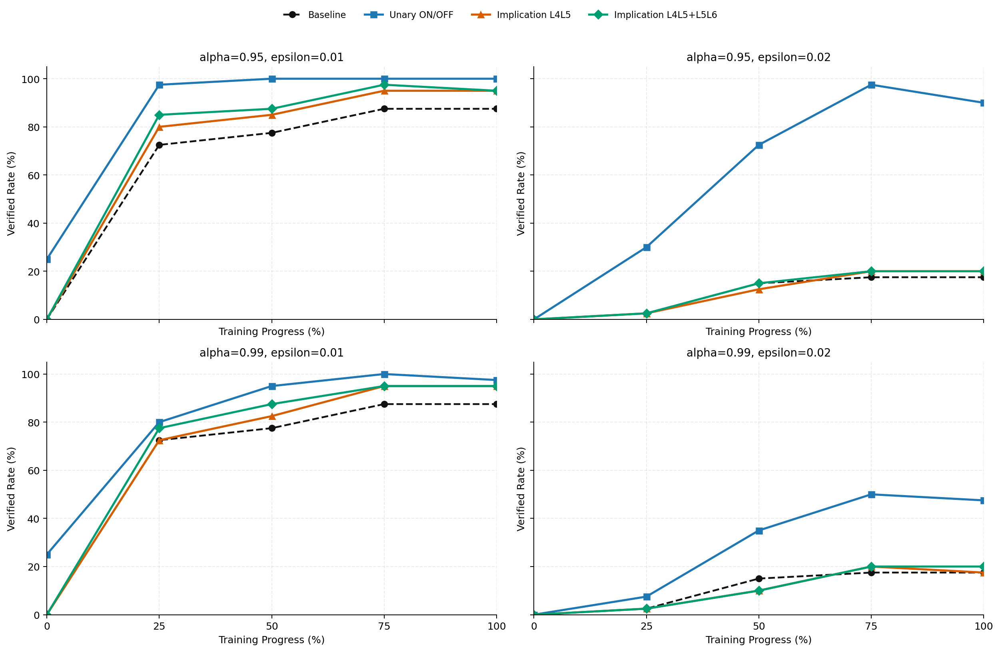
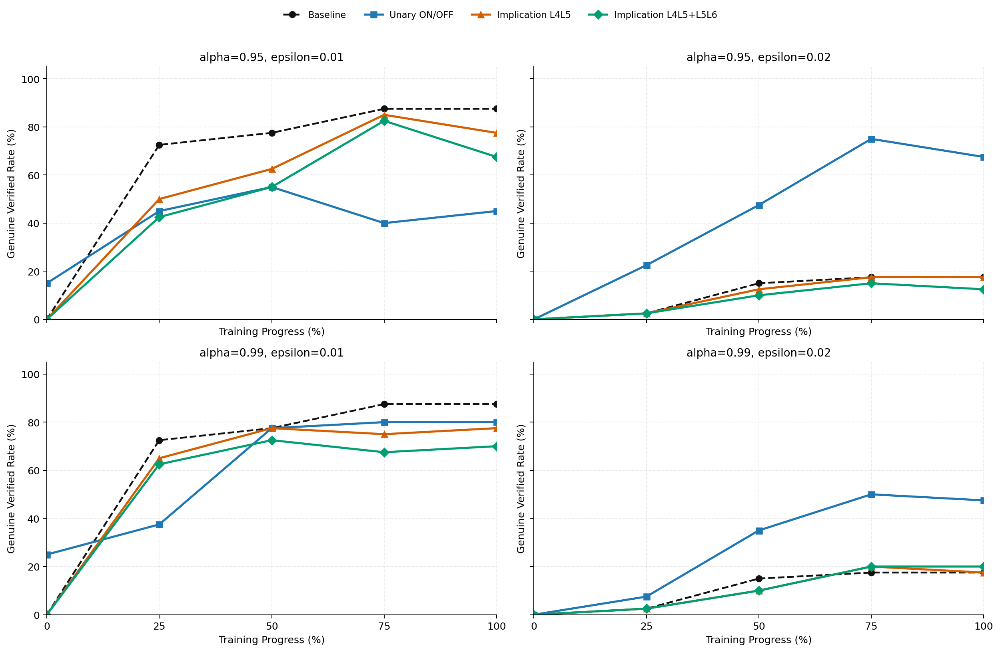
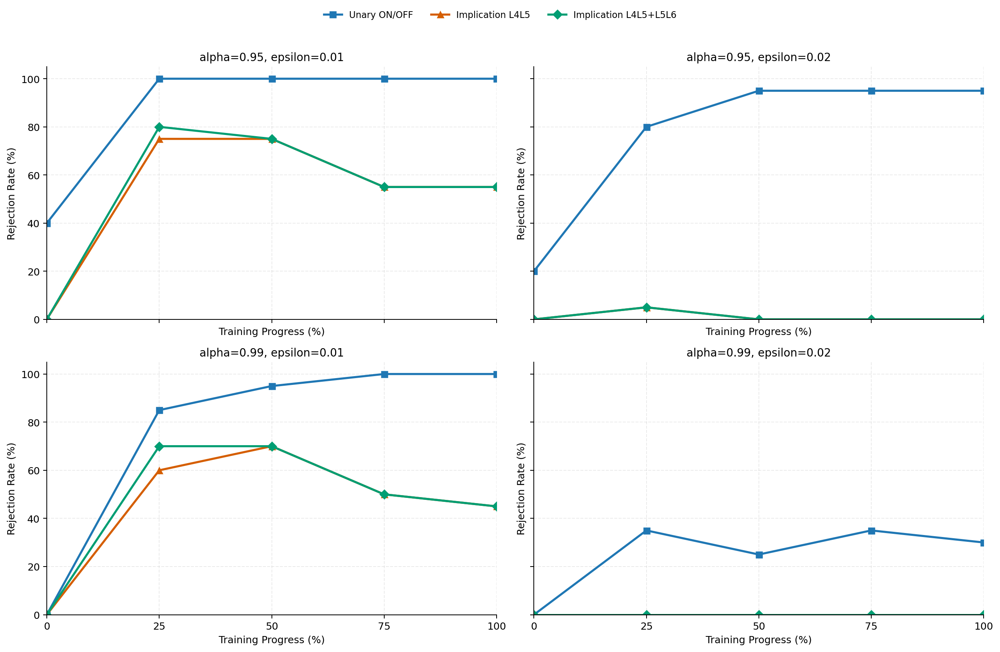

# Unary ON/OFF and Implication on Fixed Refs

This is a standalone supplement to `report.md`.

Its job is narrower than the main report:

1. keep the same Step 4 fixed-reference setting;
2. pull `implication` into the same comparison frame as unary `ALWAYS_ON / ALWAYS_OFF`;
3. compare only the exact Marabou results that already have aggregated CSV outputs.

## 0. Scope and Comparison Boundary

This supplement uses only **Step 4 exact fixed-reference Marabou** results:

- unary baseline + unary NAP:
  - `Random_Initialized_NN/generated/step4_marabou_v2/results/coverage.csv`
  - `Random_Initialized_NN/generated/step4_marabou_v2/results/rejection_summary.csv`
- implication, single last layer pair `L4L5`:
  - `Random_Initialized_NN/generated/step4_implication_A_L4L5_allrules/results/coverage.csv`
  - `Random_Initialized_NN/generated/step4_implication_B_L4L5_allrules/results/coverage.csv`
  - `Random_Initialized_NN/generated/step4_implication_A_L4L5_allrules/results/rejection_summary.csv`
  - `Random_Initialized_NN/generated/step4_implication_B_L4L5_allrules/results/rejection_summary.csv`
- implication, union of the last two layer pairs `L4L5_L5L6`:
  - `Random_Initialized_NN/generated/step4_implication_A_L4L5_L5L6/results/coverage.csv`
  - `Random_Initialized_NN/generated/step4_implication_B_L4L5_L5L6/results/coverage.csv`
  - `Random_Initialized_NN/generated/step4_implication_A_L4L5_L5L6/results/rejection_summary.csv`
  - `Random_Initialized_NN/generated/step4_implication_B_L4L5_L5L6/results/rejection_summary.csv`

The comparison rules are strict:

- same fixed refs as Step 4;
- same exact verifier family: Marabou;
- same metrics: `verified`, `genuine verified`, `rejection`;
- main comparison window: `progress >= 25%`;
- `epoch_000` is shown in the figures for context, but is not the main comparison point.

This supplement does **not** mix in:

- Step 3 per-checkpoint refs;
- auto_LiRPA trend scans;
- compressed implication runs;
- larger implication families that are still outside this selected slice.

One important boundary is already visible in the aggregated CSVs:

- for the four implication runs used here, `n_missing = 0`;
- therefore this slice is not incomplete because rows are absent;
- the real limitation is `T/o` and `semantic_unresolved`, especially at `epsilon = 0.02`.

## 1. Positive Fixed Refs: Total Verified First

Data sources:

- `report_imply_onoff_assets/positive_progress_summary.csv`
- `report_imply_onoff_assets/positive_overall_summary.csv`

Mean exact rates over `progress >= 25%`:

| Method | Alpha | `eps=0.01` verified | `eps=0.01` genuine | `eps=0.02` verified | `eps=0.02` genuine |
| --- | --- | ---: | ---: | ---: | ---: |
| Baseline | — | 81.25% | 81.25% | 13.12% | 13.12% |
| Unary ON/OFF | 0.95 | 99.38% | 46.25% | 72.50% | 53.12% |
| Unary ON/OFF | 0.99 | 93.12% | 68.75% | 35.00% | 35.00% |
| Implication `L4L5` | 0.95 | 88.75% | 68.75% | 13.75% | 12.50% |
| Implication `L4L5` | 0.99 | 86.25% | 73.75% | 12.50% | 12.50% |
| Implication `L4L5_L5L6` | 0.95 | 91.25% | 61.88% | 14.38% | 10.00% |
| Implication `L4L5_L5L6` | 0.99 | 88.75% | 68.12% | 13.12% | 13.12% |

The first reading should be:

1. If the target is **total exact verified rate**, unary ON/OFF is clearly the strongest NAP variant.
2. If the target is **exact genuine verified rate at `eps=0.01`**, the single-pair implication `L4L5` is less vacuous than unary ON/OFF at the same alpha.
3. But that does **not** mean implication beats the baseline at `eps=0.01`; baseline genuine is still `81.25%`, higher than every NAP variant here.
4. At `eps=0.02`, implication is essentially back near baseline, while unary ON/OFF remains the only variant with a large exact genuine lift.

So the clean interpretation is:

- unary ON/OFF buys the strongest region expansion;
- implication `L4L5` keeps a cleaner semantic fraction at small radius;
- but implication does not carry that advantage to `eps=0.02`.

## 2. Genuine Semantics: Where Implication Helps and Where It Stops

At `eps=0.01`, the curves separate into three behaviors:

1. baseline is still the highest exact genuine anchor;
2. unary ON/OFF pushes total verified very high, but much of that mass becomes vacuous;
3. implication, especially `L4L5`, keeps more of its verified mass genuine than unary does.

This is why `L4L5` is the most interesting implication result in this slice:

- at `alpha=0.95`, it raises exact genuine from unary `46.25%` to `68.75%`;
- at `alpha=0.99`, it raises exact genuine from unary `68.75%` to `73.75%`.

But the same figure also shows the limit:

- `L4L5_L5L6` does not consistently improve on `L4L5`;
- at `alpha=0.95`, adding `L5L6` increases total verified a little, but lowers genuine from `68.75%` to `61.88%`;
- at `alpha=0.99`, `L4L5_L5L6` also stays below the single-pair `L4L5` genuine rate.

So on the positive refs, the current exact evidence does **not** support the story:

> more implication layer pairs automatically give a better certificate.

The data instead support the narrower claim:

> among the two implication choices currently selected, the single last-layer-pair run is the cleaner one.

## 3. Why `eps=0.02` Must Be Read Together with Timeout Burden

The selected implication runs are already fully aggregated in the sense that `n_missing = 0`.
However, they are still solver-limited.

Positive-ref burden over `progress >= 25%`:

| Method | Alpha | `eps=0.01` timeout / unresolved | `eps=0.02` timeout / unresolved |
| --- | --- | --- | --- |
| Unary ON/OFF | 0.95 | `1 / 27` | `44 / 9` |
| Unary ON/OFF | 0.99 | `11 / 36` | `103 / 0` |
| Implication `L4L5` | 0.95 | `18 / 29` | `138 / 2` |
| Implication `L4L5` | 0.99 | `22 / 19` | `140 / 0` |
| Implication `L4L5_L5L6` | 0.95 | `14 / 43` | `137 / 7` |
| Implication `L4L5_L5L6` | 0.99 | `18 / 33` | `139 / 0` |

This makes the `eps=0.02` reading straightforward:

1. unary ON/OFF is still hard there, but it remains operational;
2. implication is not merely weaker there, it is almost completely timeout-dominated;
3. the union run `L4L5_L5L6` does not reduce that burden in any meaningful way.

So the present exact conclusion for implication at `eps=0.02` is not:

> implication has no effect.

It is:

> under the current formulation and solver budget, implication does not deliver a usable exact gain beyond baseline, and the solver burden remains too high.

## 4. Misclassified Refs: Unary Rejection and Implication Rejection Are Not the Same Story

Data sources:

- `report_imply_onoff_assets/rejection_progress_summary.csv`
- `report_imply_onoff_assets/rejection_overall_summary.csv`

Mean exact rejection over `progress >= 25%`:

| Method | Alpha | `eps=0.01` rejection | `eps=0.01` timeout | `eps=0.02` rejection | `eps=0.02` timeout |
| --- | --- | ---: | ---: | ---: | ---: |
| Unary ON/OFF | 0.95 | 100.00% | 0 | 91.25% | 7 |
| Unary ON/OFF | 0.99 | 95.00% | 4 | 31.25% | 51 |
| Implication `L4L5` | 0.95 | 65.00% | 27 | 1.25% | 79 |
| Implication `L4L5` | 0.99 | 56.25% | 34 | 0.00% | 80 |
| Implication `L4L5_L5L6` | 0.95 | 66.25% | 27 | 1.25% | 79 |
| Implication `L4L5_L5L6` | 0.99 | 58.75% | 33 | 0.00% | 80 |

This part is unambiguous.

Unary ON/OFF and implication do **not** induce the same rejection geometry:

1. unary ON/OFF rejects misclassified local regions aggressively and consistently;
2. implication reaches only partial rejection at `eps=0.01`;
3. implication rejection almost disappears at `eps=0.02`, where the rows become timeout-heavy and empirically close to zero rejection.

The last-two-pair union also does not materially change this picture:

- `L4L5_L5L6` is only marginally above `L4L5` at `eps=0.01`;
- at `eps=0.02`, both behave the same for practical purposes.

So if the question is:

> which NAP variant actually carves away bad local regions around misclassified samples?

then the answer in this fixed-ref exact slice is:

> unary ON/OFF, not implication.

## 5. What This Supplement Adds to the Main Story

The main report already showed that unary `ALWAYS_ON / ALWAYS_OFF` helps on fixed refs.
This supplement refines that story in a more discriminating way.

### 5.1 What survives after implication is added to the comparison

1. Unary ON/OFF remains the strongest exact method for enlarging verified regions.
2. The implication story is much narrower: it is most interesting at `eps=0.01`, where `L4L5` is less vacuous than unary ON/OFF.
3. That advantage is semantic cleanliness, not overall strength.

### 5.2 What does not survive

1. Implication does not outperform the baseline in exact genuine rate at `eps=0.01`.
2. Implication does not produce a stable exact gain at `eps=0.02`.
3. The union `L4L5_L5L6` does not show a reliable benefit over the single pair `L4L5`.

## 6. Conclusion

For the exact Step 4 fixed-reference comparison now available, the best concise reading is:

1. `Unary ON/OFF` is still the main exact success story.
2. `Implication L4L5` is interesting because at `eps=0.01` it is less vacuous than unary ON/OFF, but it is still not stronger than baseline in exact genuine rate.
3. `Implication L4L5_L5L6` does not currently justify itself as a better mainline variant.
4. At `eps=0.02`, implication is presently dominated by timeout burden and does not provide a usable exact advantage beyond unary ON/OFF.

So if this supplement is used to guide the narrative in the main report, the safest conclusion is:

> unary ON/OFF should remain the primary Step 4 NAP result,  
> while implication should be presented as a narrower, small-radius semantic contrast rather than a stronger replacement.
